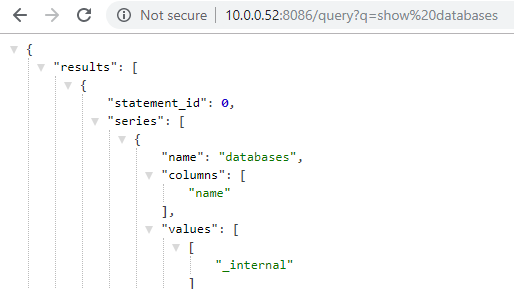
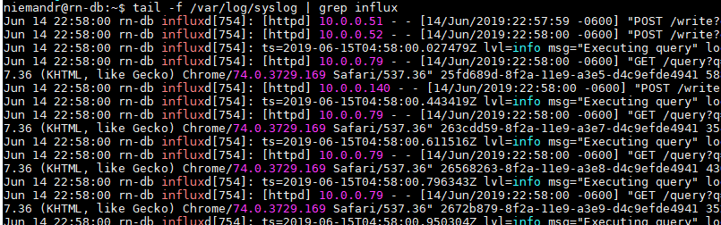

> **Hi there**! This post is [part of a series](/series/) I am doing where I attempt to move most of the applications I use at home over to Linux. If you find this interesting you may enjoy the other posts too!

This is a brief guide to get [InfluxDB](https://www.influxdata.com/products/influxdb-overview/) up and running on Ubuntu Server, you can refer to the [official documentation](https://docs.influxdata.com/influxdb/v1.7/introduction/installation/) should you run into any issues.

## Installation

Installing InfluxDB on Ubuntu is pretty straightforward and can be completed in a few simple steps.

### First Time Only

The first time you install any of the Influx Data products you will need to add their repository using the below commands:

```shell
$ sudo wget -qO- https://repos.influxdata.com/influxdb.key | sudo apt-key add -
$ source /etc/lsb-release
$ echo "deb https://repos.influxdata.com/${DISTRIB_ID,,} ${DISTRIB_CODENAME} stable" | sudo tee /etc/apt/sources.list.d/influxdb.list
```

### Install InfluxDB

After updating apt-get you can install InfluxDB with the following command:

```shell
$ sudo apt-get update && sudo apt-get install influxdb
```

### Configure InfluxDB

Should you want to make any changes to the default configuration you can edit the configuration file with the following command:

```shell
$ sudo nano /etc/influxdb/influxdb.conf
```

The most common changes I make to this file when installing InfluxDB are:

- Enable the HTTP endpoint
- Set the bind address to `0.0.0.0`

### Starting the service

Once installed you can start, stop and restart InfluxDB with the below commands:

```shell
$ sudo systemctl start influxd.service
$ sudo systemctl stop influxd.service
$ sudo systemctl restart influxd.service
```

### Testing Install

To confirm InfluxDB is working (and the HTTP endpoint is enabled) you can try listing all databases using the following URL template (http://<server_ip>:8086/query?q=show databases), in my case that would be: `http://10.0.0.52:8086/query?q=show%20databases`

You should see something like the below if all went well:



If you have any issues resolving your InfluxDB URL you can try running the following command on your server to see if there are any errors relating to InfluxDB

```shell
$ tail -f /var/log/syslog | grep influx
```

Hopefully it will shed some more light on the issue.



## Quick Reference

Some helpful commands and paths to save you some time.

- [Official Site](https://www.influxdata.com/products/influxdb-overview/)
- [InfluxDB Docs](https://docs.influxdata.com/influxdb/v1.7/introduction/installation/)

### Configuration File

```shell
$ sudo nano /etc/influxdb/influxdb.conf
```

### Service Management

```shell
$ sudo systemctl start influxd.service
$ sudo systemctl stop influxd.service
$ sudo systemctl restart influxd.service
```

### Troubleshooting

```shell
$ tail -f /var/log/syslog | grep influx
```

### Data Directories

```shell
# Where the metadata/raft database is stored
dir = "/var/lib/influxdb/meta"
# The directory where the TSM storage engine stores TSM files.
dir = "/var/lib/influxdb/data"
# The directory where the TSM storage engine stores WAL files.
wal-dir = "/var/lib/influxdb/wal"
```

### Ports

- `TCP` port `8086` client-server communication (InfluxDB HTTP API).
- `TCP` port `8088` RPC service (for backup and restore operations).
