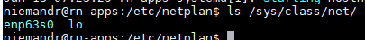

> **Hi there**! This post is [part of a series](https://www.richardn.ca/series/#home-server-revamp-2019) I am doing where I attempt to move most of the applications I use at home over to Linux. If you find this interesting you may enjoy the other posts too!
{: .prompt-tip }

Most of the information in this post is a simplified version of the [following guide](https://ubuntu.com/server/docs). Basically you can think of this as the CliffsNotes for getting up and running with a static IP Address on Ubuntu Server.

First you will need the name of the NIC you want to assign the static IP Address to. This is as simple as running the below command and picking the most appropriate sounding name form the results:

```shell
$ ls /sys/class/net/
```



In my case my NIC would be `enp63s0`.

Next you will need to create (or edit) the /etc/netplan/99_config.yaml file:

```shell
$ sudo nano /etc/netplan/99_config.yaml
```

Add the below lines to the file substituting in your NIC and desired IP Addresses where applicable:

```yaml
network:
  version: 2
  renderer: networkd
  ethernets:
    enp63s0:
      addresses:
        - 10.0.0.51/24
      gateway4: 10.0.0.1
```

Save and close the file followed by restarting the network service via netplan.

```shell
$ sudo netplan apply
```
