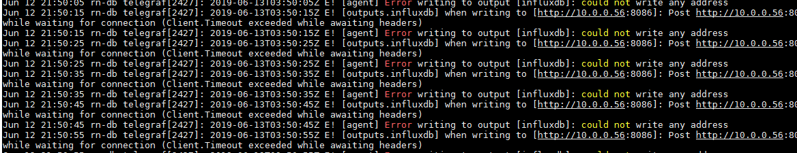

> **Hi there**! This post is [part of a series](https://www.richardn.ca/series/#home-server-revamp-2019) I am doing where I attempt to move most of the applications I use at home over to Linux. If you find this interesting you may enjoy the other posts too!
{: .prompt-tip }

[Telegraf](https://www.influxdata.com/time-series-platform/telegraf/) is the open source server agent to help you collect metrics from your stacks, sensors and systems. Following the steps below should get you up and running with Telegraf in no time. Should you want to dive a bit deeper into some of the features offered by Telegraf you may want to refer to the [official documentation here](https://docs.influxdata.com/telegraf/v1.11/introduction/installation/).

## First Time Only
The first time you install any of the Influx Data products you will need to add their repository using the below commands:

```shell
sudo wget -qO- https://repos.influxdata.com/influxdb.key | sudo apt-key add -
source /etc/lsb-release
echo "deb https://repos.influxdata.com/${DISTRIB_ID,,} ${DISTRIB_CODENAME} stable" | sudo tee /etc/apt/sources.list.d/influxdb.list
```

## Installing Telegraf
Once you have added the InfluxData source to your system, you can install Telegraf with the below command:

```shell
sudo apt-get update && sudo apt-get install telegraf
```

## Configuring Telegraf
Once installed, you will need to make some changes to the default configuration file that Telegraf ships with. To do this we can edit the `telegraf.conf` file.

```shell
sudo nano /etc/telegraf/telegraf.conf
```

### InfluxDB (Output)
You will need to enable at least 1 output for Telegraf, in my case (and most commonly) this would be [InfluxDB](https://www.richardn.ca/posts/InstallingInfluxDBOnUbuntu/). Search for the `[[outputs.influxdb]]` configuration section and change as needed, my configuration is shown below:

```ini
[[outputs.influxdb]]
  urls = ["http://10.0.0.56:8086"]
  database = "telegraf"
```

### net (Input)
To collect networking stats for your computer you will need to enable the [[inputs.net]] plugin. Part of the configuration for the plugin is setting the interface name for your network card (the name varies from system to system) - the easiest way to get your interface name is by listing all the networking devices on your computer and choosing the most appropriate one from the results:

```shell
ls /sys/class/net/
```


Once you have your adapter name change your configuration to match it, in my case I am using the following configuration:

```ini
[[inputs.net]]
  interfaces = ["eno1"]
```

### Default (Input)
When installing Telegraf on my system the following plugins seemed to be enabled by default (though your mileage may vary):

- [inputs.cpu](https://github.com/influxdata/telegraf/blob/release-1.11/plugins/inputs/cpu/README.md)
- [inputs.disk](https://github.com/influxdata/telegraf/blob/release-1.11/plugins/inputs/disk/README.md)
- [inputs.kernel](https://github.com/influxdata/telegraf/blob/release-1.11/plugins/inputs/kernel/README.md)
- [inputs.mem](https://github.com/influxdata/telegraf/blob/release-1.11/plugins/inputs/mem/README.md)
- [inputs.processes](https://github.com/influxdata/telegraf/blob/release-1.11/plugins/inputs/processes/README.md)
- [inputs.swap](https://github.com/influxdata/telegraf/blob/release-1.11/plugins/inputs/swap/README.md)
- [inputs.system](https://github.com/influxdata/telegraf/blob/release-1.11/plugins/inputs/system/README.md)

A complete list of Telegraf plugins can be found [here](https://docs.influxdata.com/telegraf/v1.11/plugins/plugin-list/).

## Service Management
You can use the below commands to manage the Telegraf service after making configuration changes.

```shell
sudo systemctl status telegraf.service
sudo systemctl start telegraf.service
sudo systemctl stop telegraf.service
sudo systemctl restart telegraf.service
```

> Make sure you remember to restart the service after making configuration changes.
{: .prompt-tip }

## Troubleshooting
Should you run into any issues with starting Telegraf, or you are missing data you can always run the below command to get the last couple of messages from Telegraf:

```shell
sudo systemctl status telegraf.service
```

Should the above not provide you any insight you could always run cat and grep on syslog to listen for new Telegraf events and print them to your screen:

```shell
tail -f /var/log/syslog | grep telegraf
```

In my case I had set the incorrect URL for InfluxDB :/



## All Done
Hopefully you find this post helpful!

Feel free to leave any feedback or comments below, or if you spot an issue let me know so I can fix it. Happy monitoring!
