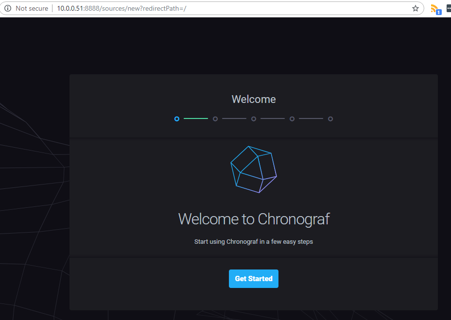

> **Hi there**! This post is [part of a series](/series/) I am doing where I attempt to move most of the applications I use at home over to Linux. If you find this interesting you may enjoy the other posts too!

Today I will be covering getting [Chronograf](https://www.influxdata.com/time-series-platform/chronograf/) up and running on Ubuntu.

## Installation

**Note**: You will need to have a working [InfluxDB 1.x](/blog/2019/2019-06-14/post1/) instance deployed to follow along!

First you will need to pick the latest version of Chronograf for your system from this list and download it on the target machine (at the time of writing that was chronograf_1.7.11_amd64.deb).

```shell
wget https://dl.influxdata.com/chronograf/releases/chronograf_1.7.11_amd64.deb
```

Once downloaded, run the below command to install:

```shell
sudo dpkg -i chronograf_1.7.11_amd64.deb
```

Once installed, you can remove the downloaded package with the following command:

```shell
sudo rm -f hronograf_1.7.11_amd64.deb
```

## Creating a "Service"

You can configure Chronograf to run as a service by running the below commands:

```shell
sudo systemctl enable chronograf.service
sudo systemctl --system daemon-reload
sudo systemctl start chronograf.service
```

## Testing and Configuration

Once running you should be able to navigate to your servers IP Address on port `8888` to see the Chronograf UI - in my case the URL would be: `http://10.0.0.51:8888/`

If all went well you should be greeted with the configuration screen as shown below, simply follow the steps in the wizard to complete the installation.



You should now have a working instance of Chronograf on your server, good job!
