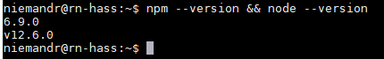
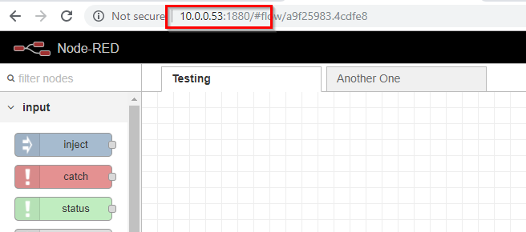
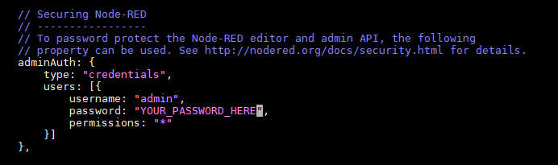
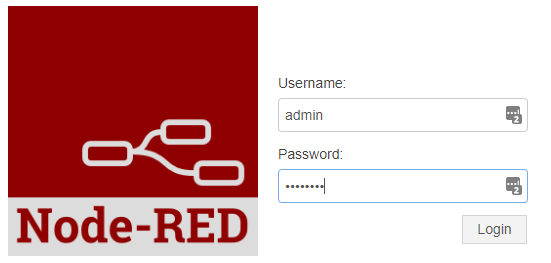
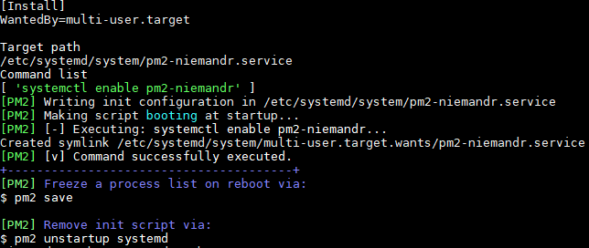
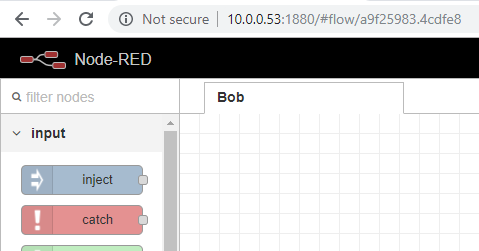
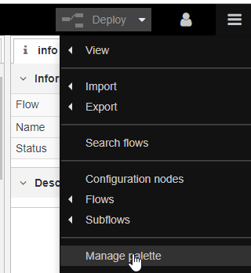
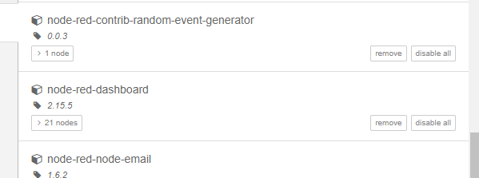
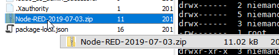
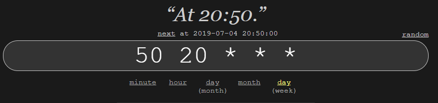

> **Hi there**! This post is [part of a series](/series/) I am doing where I attempt to move most of the applications I use at home over to Linux. If you find this interesting you may enjoy the other posts too!
{: .prompt-tip }

Today I will be covering getting up and running with [Node-RED](https://nodered.org/) on your server. This process is slightly more involved compared to all the previous instals we have done so far, however this post aims to make it as simple as possible!

## Installing Node.js
In order to run Node-RED you will need to have [Node.js](https://nodejs.org/en/) installed, these steps are a condensed version of the [official installation guide](https://github.com/nodesource/distributions/blob/master/README.md#debinstall) for Ubuntu.

To install Node.js 12.x simply run the below command on your server:

```shell
curl -sL https://deb.nodesource.com/setup_12.x | sudo -E bash -
```

Once complete you can install Node.js using the following command:

```shell
sudo apt-get install -y nodejs
```

You can run the below command to verify that the installation succeeded:

```shell
npm --version && node --version
```

You should see output similar to the below:



## Installing Node-RED
Once we have Node.js installed we can move on to installing Node-RED, the below commands are taken from the [official documentation](https://nodered.org/docs/getting-started/local).

> **Note**: you will need to run most of these commands as `sudo`
{: .prompt-info }

You can install Node-RED with the below command:

```shell
sudo npm install -g --unsafe-perm node-red
```

Once installed, you can test that everything is working by launching Node-RED with it's default settings:

```shell
node-red
```

Once Node-RED has started you should be able to access it on your server's IP Address on port 1880 in my case that would be http://10.0.0.53:1880.



## Securing Node-RED
If you are planning on making your Node-RED installation accessible on your home network (or the web) it is a good idea to secure it with a password, follow the steps below to add the default admin user and custom password to your instance.

First you will need to install the `node-red-admin` package.

```shell
sudo npm install -g node-red-admin
```

Once installed run the below command making sure to follow the prompts to generate your password hash:

```shell
node-red-admin hash-pw
```

Once you have the hashed password we will need to edit Node-RED's `settings.js` file and enable the admin user account, you can edit the file with the following command:

```shell
sudo nano /home/niemandr/.node-red/settings.js
```

Find the `Securing Node-RED` section (shown below) and un-comment the `adminAuth` section making sure that you replace the default password with the hash generated above.



Next, save and close the configuration file and restart Node-RED (for now you can just run it from the terminal via the node-red command). Once started head over to the Web UI and you should be presented with a login dialog similar to this:



You should be able to now log in using the admin user and your selected password!

## Create a Node-RED Service
Ideally we want Node-RED to start when the server boots, after some digging online the below process worked best for me ([more information here](https://nodered.org/docs/faq/starting-node-red-on-boot)). Basically we are going to install [pm2](https://www.npmjs.com/package/pm2) which is a process manager plugin for Node.js and can be configured to start services on boot.

### Installing pm2
You can install pm2 using the following command:

```shell
sudo npm install -g pm2
```

Once installed you will need to get the path to the node-red executable using the which command:

```shell
which node-red
```

In my case I am using the default Node-RED binary (`/usr/bin/node-red`).

You can test that everything is working as expected by running the below command (making sure to use the path to your node-red binary):

```shell
pm2 start /usr/bin/node-red -- -v
```

This should start Node-RED in the background, you can view information about the process and access the log output using the commands:

```shell
pm2 info node-red
pm2 logs node-red
```

### Starting Node-RED on boot
You can configure Node-RED to start on boot by running the below commands, you will need to have pm2 installed (covered above):

```shell
pm2 save
pm2 startup systemd
```

The last command will output another command that you will need to run in order to configure Node-RED to start up on server reboot, in my case the following output was generated (Note the output may vary for your setup).

```shell
sudo env PATH=$PATH:/usr/bin /usr/lib/node_modules/pm2/bin/pm2 startup systemd -u niemandr --hp /home/niemandr
```

After running the generated command on my server I got confirmation that Node-RED was configured to start on boot:



The only thing left to do now, is to restart the server and see if Node-RED starts by itself, and in my case it did!



## Fixing Node-RED permissions
Presumably you installed Node-RED using your user account (as root is disabled by default on Ubuntu), so you will need to amend some permissions before you can install any additional pallets to Node-RED.

After some digging on Google I came across this post which had an all-in-one command that fixed my permissions perfectly, maybe this will save you some time!

Navigate to your Node-RED folder (in my case it was `/home/niemandr/.node-red`) and run this command to fix permissions:

```shell
sudo find ~ -type d -user root -exec sudo chown -R $USER: {} +
```

> **NOTE**: you need to be in your Node-RED directory before running this command!
{: .prompt-tip }

## Installing Palettes
Once you have fixed the permissions (covered above) you should be able to install any palettes normally through Node-RED.



Thanks to the fix above I was able to install all the palettes I needed with no permission errors.



## Automated Backups
As a bonus I thought I would cover creating automated backups of your Node-RED server using a CRON job.

### The zip command
Node-RED stores all your flows in a file with the flows_<HOST>.json naming convention, in my case that was:

```shell
/home/niemandr/.node-red/flows_<HOST>.json
```

I would like to backup this file along with the settings.js file daily. The easiest way I could think of doing this was to make use of the zip command which we will need to first install using:

```shell
sudo apt install zip
```

We can simply zip any files matching the `*.json` pattern in your Node-RED configuration folder (in my case that was `/home/niemandr/.node-red`) using the below command:

```shell
zip "/home/niemandr/Node-RED-$(date '+%F').zip" /home/niemandr/.node-red/*.json
```

This will create a zip file with the following naming convention: `Node-RED-<DATE>.zip`:



### Creating the CRON
You can manage your CRON jobs using the below command:

```shell
crontab -e
```

If this is the first time working with users' CRON jobs you will be prompted to create a new file, if this is the case just use the suggested defaults.

Add the below line to your CRON file (making changes where required):

```
50 20 * * * zip "/home/niemandr/Node-RED-$(date '+\%F').zip" /home/niemandr/.node-red/*.json
```

You can use [this site](https://crontab.guru/) to help generate a suitable CRON schedule expression, as you can see I have configured mine to run every day at 8:50 pm:



Once done, save and close the CRON file.

You are now configured with daily backups of your Node-RED service!

## In Closing
This was a longer post than normal, and I would like to thank you for sticking it out to the end! I always welcome any comments, suggestions and feedback on these posts as it helps me learn.

If you are stuck feel free to ask me a question and I will do my best to answer you ASAP.
