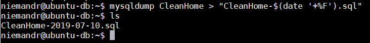

> **Hi there**! This post is [part of a series](/series/) I am doing where I attempt to move most of the applications I use at home over to Linux. If you find this interesting you may enjoy the other posts too!

Once you have your [MariaDB (MySQL alternative)](/blog/2019/2019-06-15/post/) instance up and running, it would be a good idea to automate backing up your important databases. In this post I will cover performing a simple daily backup of your databases using [mysqldump](https://mariadb.com/kb/en/mariadb-dumpmysqldump/).

## Create ".my.cnf"

To make your backups easier I would suggest creating a `.my.cnf` file in your CRON users home directory. When `mysqldump` runs it will search for the current users' `.my.cnf` file to load additional settings (e.g. DB credentials) allowing you to omit them from the CRON jobs command.

To create the .my.cnf file, log in as the desired user and run the below command:

```shell
sudo nano ~/.my.cnf
```

Add the following to the file making sure to replace the `<USER>` and `<PASS>` placeholders with your credentials.

```ini
[mysqldump]
host = 127.0.0.1
port = 3306
user = <USER>
password = <PASS>
```

## Testing mysqldump

Before continuing it would be a good idea to make sure that mysqldump is able to read your configuration file and connect to your local database instance.

In my case I would like to create a daily backup of my CleanHome database, to create the backup I would run the following command:

```shell
mysqldump CleanHome > "CleanHome-$(date '+%F').sql"
```

If everything works as expected a backup file should appear in your current working directory.



## Creating the CRON job

Next we need to register a daily CRON job to automatically run our mysqldump command. The easiest way to do this would be to make use of the crontab command (choosing basic if prompted):

```shell
crontab -e
```

Add your backup command at the end of the file, in my case I added this:

```
00 22 * * * mysqldump --databases CleanHome > "/home/niemandr/CleanHome-$(date '+\%F').sql"
```

> **Note**: you need to escape special characters with an "\" (e.g. `\%F` in the date command). You can use [crontab.guru](https://crontab.guru/#00_22_*_*_*) to help build your CRON expression.

Close the text editor making sure to save your changes.

You have successfully created your backup job!

## Troubleshooting

Below are some helpful tips for troubleshooting a failing CRON job.

### Reload all CRON jobs

Some linux distributions may not automatically refresh jobs when a change has been made (Ubuntu does BTW), if your job is not running you could try reloading with this command:

```shell
sudo service cron reload
```

### Tail your system log file

You can troubleshoot a failing job by looking at your systems log file (on Ubuntu `/var/log/syslog`) for any entries containing your CRON job, in our case you can use the following command:

```shell
cat /var/log/syslog | grep mysqldump
```

Ideally you can schedule the job to run on the next min and tail your systems log file:

```shell
tail -f /var/log/syslog
```

If you are lucky you may see the reason for the failure logged.

## In Closing

I hope that you found this post helpful, in the not-so-far future I will be doing a follow up post that makes use of a shell script to do a lot more than just dumping the DB (I just need some time to research it).

As always comments, feedback and suggestions are always welcome as it helps me and others learn.

Happy hacking!
