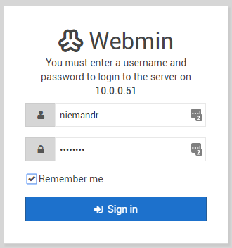
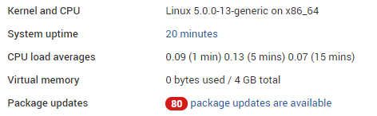
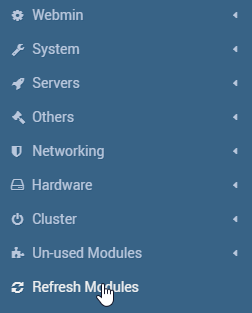
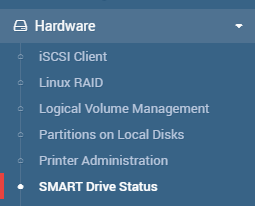
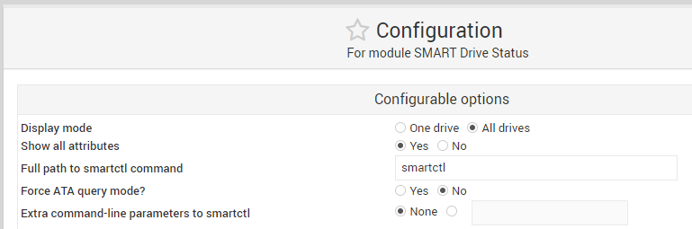
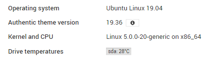

> **Hi there**! This post is [part of a series](/series/) I am doing where I attempt to move most of the applications I use at home over to Linux. If you find this interesting you may enjoy the other posts too!

Today I will be covering installing [Webmin](https://www.webmin.com/) on Ubuntu (and Ubuntu Server), in case you are unaware of it (I was initially) here is a blurb taken from their website.

Webmin is a web-based interface for system administration for Unix. Using any modern web browser, you can set up user accounts, Apache, DNS, file sharing and much more.

I highly recommend checking out "[the official deployment guide](https://www.webmin.com/deb.html)", so should you get stuck with any of the steps below.

## Installation

First you will need to download the latest version of the Webmin installer on your server. You can get this link from their deployment guide, at the time of writing this post `webmin_1.920_all.deb` was the latest version. Once you are connected to your server you can simply download it using the following command (making sure that you reference the current version.

```shell
wget http://prdownloads.sourceforge.net/webadmin/webmin_1.920_all.deb
```

Once the download has completed you can install the package using dpkg as an elevated user.

```shell
sudo dpkg --install webmin_1.920_all.deb
```

I initially ran into some issues with the installation due to missing packages.

```
dpkg: error processing package webmin (--install):
 dependency problems - leaving unconfigured
Processing triggers for systemd (240-6ubuntu5) ...
Errors were encountered while processing:
 webmin
```

Thankfully this was easily resolved using `apt`:

```shell
sudo apt --fix-broken install
```

After that, I was able to re-run the installation with no errors.

```shell
sudo dpkg --install webmin_1.920_all.deb
```

Don't forget to remove the installer once completed!

```shell
rm webmin_1.920_all.deb
```

## Connecting to Webmin

By default, the Webmin UI is exposed on port 10000 on your server's IP Address, connecting to it is as simple as navigating to `https://<SERVER-IP>:10000` in your favourite browser.



You can log into Webmin using the same credentials you use to ssh into your server.

When prompted to, I would highly suggest allowing Webmin to show you desktop notifications.

Before continuing, it may be a good idea to install any missing updates to your server (they normally appear as shown below on Webmins landing page).



## Modules

One of the cool features with Webmin are its modules (plugins). There are a lot of modules available with some sensible defaults enabled. You can easily get a list of any disabled modules through the un-used Modules link.



Setup and configuration of each module will vary so I can't cover all of them (thankfully their documentation is good). The only module I normally enable is the SMART Drive Status module as it provides some useful information about any drives attached to my servers.
The next section will walk you through installing the required services to get up and running with the SMART Drive Status module.

### SMART Drive Status

The SMART Drive Status module requires Smartmontools to be installed, you can install smartmontools with the below command:

```shell
sudo apt install -y smartmontools
```

During the installation process you will be prompted to enter in some information, from my experience the default (suggested) value worked perfectly.

After the installation has completed you can click Refresh Modules to allow Webmin to discover the newly installed smartmontools package.



You should now be able to see the plugin under the Hardware menu node.

Clicking the configuration cog (in the top left corner) will bring up the modules configuration page.



I would suggest enabling the module for all drives (as shown above).

That's all there is to it, you should now see some additional drive information on the Webmin's overview page.



## In Closing

Hopefully you found this post helpful and were able to get your own deployment of Webmin up and running. If you get stuck feel free to ask a question below if you are unable to find an answer on [the official Webmin](https://www.webmin.com/) site, I am always happy to try to help out.

I am open to any feedback, comments and suggestions that you may have so please feel free to leave some, I will do my best to get back to you as soon as possible.
