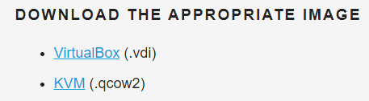
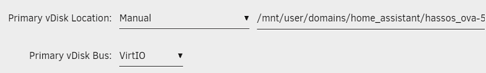
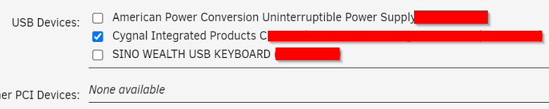
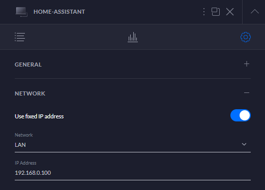
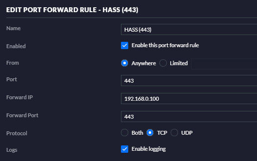
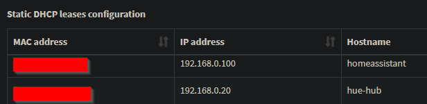
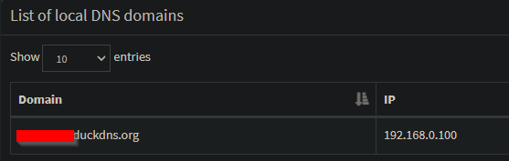
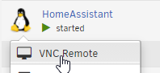
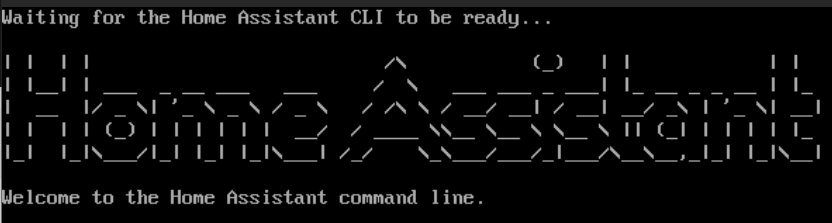

I have been running [Home Assistant](https://www.home-assistant.io/) for years, and absolutely love it. By far the easiest way to run Home Assistant is using the official [Home Assistant Operating System](https://www.home-assistant.io/installation/linux), specifically the `.qcow2` image paired with my local [Unraid](https://unraid.net/) server.

As there are literally thousands of posts out there covering the deployment of Home Assistant online, this post is more of a quick reference for those people who want to get up and running quickly, let's dive in:

## Grab the latest image
First we will need to grab the latest build of [Home Assistant Operating System](https://www.home-assistant.io/installation/linux).

We are interested in the `.qcow2` image as stated above.

You will need to upload the image to your Unraid's domains domain folder (or wherever you store your VM images).

## VM Setup
Once you have the image downloaded, head over to the VMS tab in Unraid and create a new Linux VM with the following configuration.

- **Name**: HomeAssistant
- **Memory**: 2GB (or more)
- **CPU(s)**: Assign an amount that makes sense to you (I am using 4)
- **Machine**: Q35-5.1 (or whatever is latest)
- **BIOS**: OVFM
- **Primary vDisk**: `/mnt/user/domains/homeassistant/hassosova-5.13.qcow2`

- **Network MAC**: Anything that you want (I just used the suggested value)
- **USB Devices**: Here you can select any USB devices you wish to pass through to Home Assistant

That covers all the configuration needed for the VM.

> **Note**: don't start the VM yet - we still need to do some additional configuration on our router first!
{: .prompt-warning }

## Router Configuration
To make things easy, I would suggest setting a static IP address for Home Assistant on your router - again this can vary a LOT depending on the make and model of your router. Ideally we are wanting to get the following configured:

- **Static IP Address** - this will ensure that we can always access Home Assistant on a known IP Address
- **Port Forwarding** - (optional) Allow external access to Home Assistant from the outside world - super useful if you are running presence detection

For my router I assigned `192.168.0.100` to Home Assistant as shown below:

Additionally I have re-mapped the default port `8123` to `443` (https) and forwarded all incoming TCP traffic to my Home Assistant server as shown below:

> **Note**: You don't need to change the default port, I am making use of some integrations that require Home Assistant to be running on 443.
{: .prompt-info }

## Pi-hole / DHCP / DNS Configuration (Optional)
I run [Pi-hole](https://pi-hole.net/) locally to block adverts on my internal network, along with this I am using Pi-hole as a DHCP server so I need to ensure that I add a reservation for Home Assistant (based on the VMS MAC Address) as shown below:

Adding this reservation will ensure that my VM is assigned the correct IP Address when it first boots.

Additionally I need to add a DNS record for my external Home Assistant URL to make client configuration easier (this may not be required on your end). Basically this allows me to use the same URL for Home Assistant for all my devices regardless of what network they are connected to:

That covers the optional DNS / DHCP configuration.

## Onboarding
It's that simple, your next step is to start the VM and configure your new Home Assistant server.

It may take some time for the VM to complete its initial boot (as there are a lot of once off scripts \ configuration that need to run), you can make use of the VNC Remote utility to see exactly where you are in the initial boot process should the need arise.

Once everything is completed the VM should default to the following screen.

Happy hacking!
