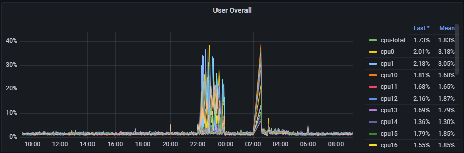
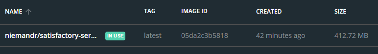
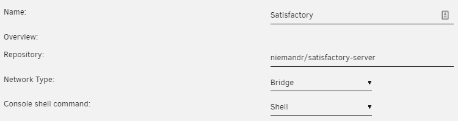
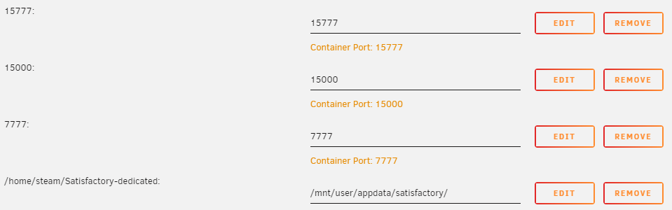

With the release of Satisfactory Update 5 comes the addition of dedicated servers, something interesting on the [official wiki](https://satisfactory.fandom.com/wiki/Dedicated_servers#Running_manually_within_a_Docker_container) something interesting caught my eye - the ability to run the server as a Docker Container which is amazing!

> **TL;DR**: you can make use of the niemandr/satisfactory-server Docker container listed below to run the server - this is updated daily
{: .prompt-tip }

> **Sad News**: this is no longer maintained by me as there is a better way to do this
{: .prompt-warning }

At home I am running an old `HP DL180G6` using [Unraid](https://unraid.net/) (equipped with 24 cores, 128 GB RAM) and a handful of Docker containers. Generally this server just sits there idling, so this is a perfect candidate for running a dedicated Satisfactory Server.



> **Note**: The first spike is me testing out the server with my SO, and the second one is my nightly snapshot \ verification of my server.
{: .prompt-info }

To make things a lot easier I decided to make use of [Github Actions](https://github.com/features/actions) to automate the build and publish the result to [Docker Hub](https://hub.docker.com/) using the following configuration:

```yaml
name: Docker Image CI
on:
  push:
    branches: [ main ]
  schedule:
  - cron: "30 23 * * *"
jobs:
  build:
    runs-on: ubuntu-latest
    steps:
    - uses: actions/checkout@master
    - name: Publish to Registry
      uses: jerray/publish-docker-action@master
      with:
        username: ${{ secrets.DOCKER_USERNAME }}
        password: ${{ secrets.DOCKER_PASSWORD }}
        repository: niemandr/satisfactory-server
```

## Running the server
To run the server from a command line you can use:

```shell
docker run -p 15000:15000/udp -p 7777:7777/udp -p 15777:15777/udp -d --name=satisfactory -v C:/docker-data/satisfactory:/home/steam/Satisfactory-dedicated niemandr/satisfactory-server:latest
```

This will download and start the container using `C:\docker-data\satisfactory` as a DATA folder.



## Running on Unraid
For Unraid, the setup is a lot simpler:



- **Name**: Whatever you would like to call your server
- **Repository**: Must be niemandr/satisfactory-server
- **Network Type**: Bridge



At the moment some ports for the server cannot be changed (see the [wiki](https://satisfactory.fandom.com/wiki/Dedicated_servers#Running_manually_within_a_Docker_container)) so the following ports need to be exposed:

- `15777` - Dedicated server port (can be changed)
- `15000` - BeaconPort
- `7777` - Base game port?

If you wish to expose your server to the internet you will need to make sure that you forward all incoming UDP traffic on those ports specifically as the server does not support port-mapping at the moment.


Happy Pioneering
