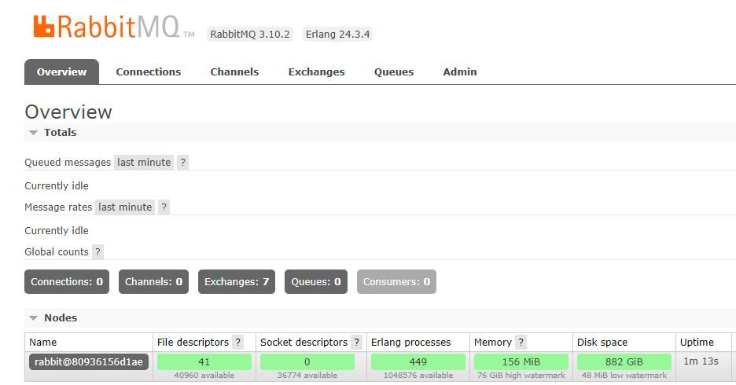

> This post is [part of a series](/series/) covering running various containers on [Unraid](https://unraid.net/).
{: .prompt-tip }

This is a quick post on getting [RabbitMQ](https://www.rabbitmq.com/) up and running in a Docker container on [Unraid](https://unraid.net/), this post is based on the [official docker image](https://hub.docker.com/_/rabbitmq).

## Configuration
### Repository Tag
Personally I prefer using the built-in management plugin, so I opt for this tag:

- **Repository**: `rabbitmq:3-management`

### Ports
You will need to expose the following ports:

- Port: `5672` used by RabbitMQ
- Port `15672` used by the admin UI

## Paths
You will need to have the following paths configured for your container:

> **Note**: Make sure that `rabbitmq.conf` exists locally before you start the container.
{: .prompt-warning }

- `/etc/rabbitmq/rabbitmq.conf` -> `/mnt/user/appdata/rabbitmq/config/rabbitmq.conf`
- `/var/lib/rabbitmq` -> `/mnt/user/appdata/rabbitmq/data/`

You can refer to [this link](https://github.com/rabbitmq/rabbitmq-server/blob/v3.8.x/deps/rabbit/docs/rabbitmq.conf.example) for an example configuration file.

You can refer to the [official documentation](https://www.rabbitmq.com/configure.html#configuration-files) for all available configuration options.

### Variables
- `RABBITMQ_DEFAULT_USER` = admin
- `RABBITMQ_DEFAULT_PASS` = password

## Running
That's all you need to get up and running, once the container has started you can head over to: http://192.168.0.60:15672/ and login with the credentials you set.

Enjoy!
