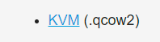
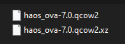
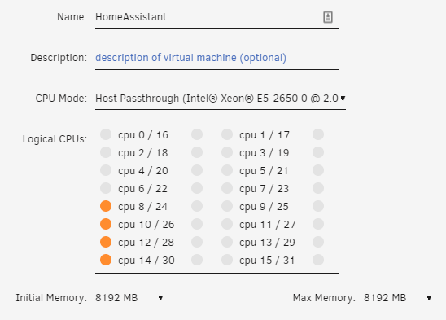
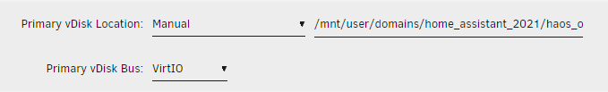
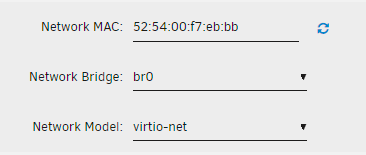
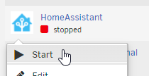
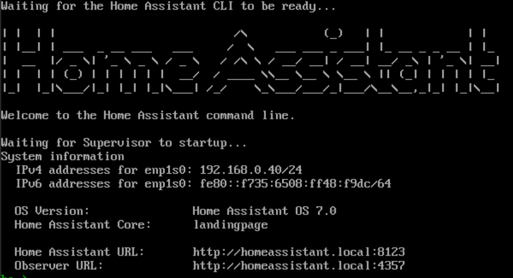
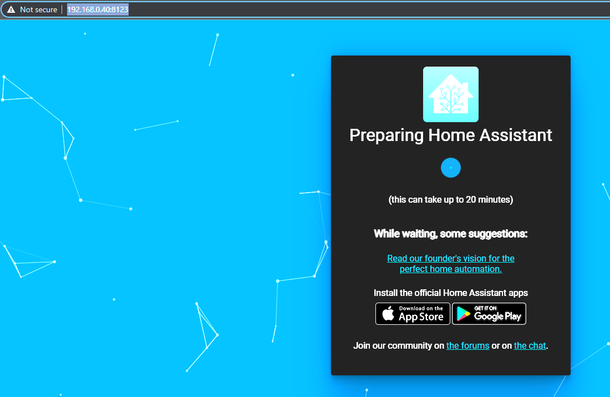
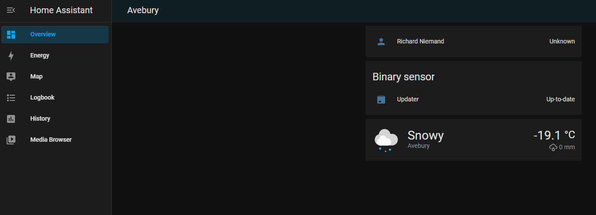

> This post is [part of a series](https://www.richardn.ca/series/#unraid-containers-2022) covering running various containers on [Unraid](https://unraid.net/).
{: .prompt-tip }

## Download the VM Image
First you will need to obtain the latest image from the Home Assistant website ([see this page](https://www.home-assistant.io/installation/alternative)) - in my installation I am using the .qcow2 image as shown below:



Once downloaded you can use a tool like [7-Zip](https://www.7-zip.org/) to extract the contents to a working folder, you should now have the following files:


_This is the extracted contents of the zip file_

## Create the Home Assistant VM
Next, you will need to create a new VM in Unraid making use of the Linux template and apply the appropriate configuration for your VM, in my case I used the following.



- **VM Name**: HomeAssistant
- **CPU Assignment**: decided to go with 4 CPU's to start (can always add more later on)
- **Memory**: Started with 8 GB - however you can get away with as little a 1 GB in a pinch



Ensure that you set the Primary vDisk Location to point to the `.qcow2` image you downloaded - I would suggest placing the image in your `/mnt/user/domains/...` directory as this is the assumed location by Unraid when working with virtual machines.



Ensure that you assign the network as bridged as some of the functionality of Home Assistant will break without this - assign a MAC Address for the VM (you can use this to enforce static IPs on your router) and select the appropriate network driver.

### Adding an Icon
You can edit the XML file for your VM as shown below to add in a custom image for Home Assistant to make your VM stand out (if you have a number of them).

```xml
<?xml version="1.0" encoding="UTF-8"?>
<domain type="kvm">
  <name>HomeAssistant</name>
  <uuid>054a17e7-fdc0-3238-bf05-6d00ad80b7b3</uuid>
  <metadata>
    <vmtemplate xmlns="unraid" name="Linux" icon="/mnt/user/domains/home_assistant_2021/logo.png" os="linux"/>
  </metadata>
```

## First Time Setup
Once your VM is created and you are happy with the configuration you can start it:


_Showing off the custom logo assigned above_

It may take some time for the initial startup to complete, you can connect to the VM using the built in VNC browser and should see the following splash screen when Home Assistant has successfully started up:



You can now connect to Home Assistant using one of the URLs provided:



You will need to wait for the onboarding process to complete (it can take some time). Follow the instructions and prompts to finish the installation.



You are done!
