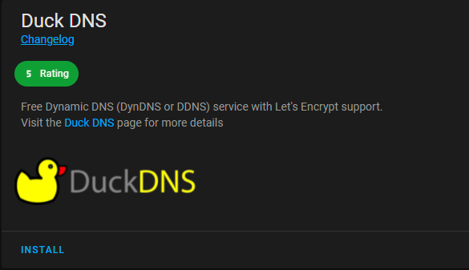

> This post is [part of a series](/series/) covering running various containers on [Unraid](https://unraid.net/).

Today I will be covering setting up DNS and HTTPS on your local Home Assistance instance making use of [Duck DNS](https://www.duckdns.org/) and [Let's Encrypt](https://letsencrypt.org/).

The process is pretty simple and requires only a few steps to complete.

## Static IP Address and port forwarding

First you will need to set a static IP Address for your Home Assistant server, generally you would do this at your router level reserving a static lease for the MAC Address of your server.

Once you have a static IP Address you will need to forward all traffic on `TCP_443` (`HTTPS`) to your Home Assistant server's IP Address (again, usually done through your router).

## Create a Duck DNS Domain

Next you will need to head over to Duck DNS and create a domain to use with your Home Assistance instance.

## Configuring Home Assistant

Next you will need to create a new file in your configuration folder called http.yaml to store the required configuration settings.

Add the following contents to `http.yaml`:

```yaml
ssl_certificate: /ssl/fullchain.pem
ssl_key: /ssl/privkey.pem
server_port: 443
```

You can include this configuration in Home Assistant by adding the following line to your configuration.yaml file: `http: !include custom/http.yaml`

### Install Duck DNS Addon

Under Home Assistant add ons, find and install the Duck DNS plugin:



Once installed follow the prompts when setting up the Add-On making sure to substitute your token where necessary. In addition, please ensure that the rest of your configuration looks like this:

```yaml
accept_terms: true
algo: secp384r1
certfile: fullchain.pem
keyfile: privkey.pem
```

It should now be safe to restart Home Assistant for the changes to take effect.

> **NOTE**: you will no longer be able to access Home Assistant on HTTP

You should now be able to access Home Assistant over HTTPS.
