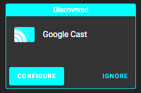
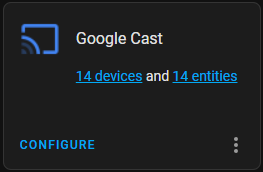
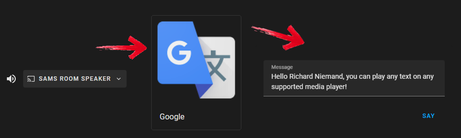

> This post is [part of a series](https://www.richardn.ca/series/#unraid-containers-2022) covering running various containers on [Unraid](https://unraid.net/).
{: .prompt-tip }

Today I will cover setting up TTS on Home Assistant using the Google Cast integration.

## Basic Discovery
Out of the box Home Assistant should automatically discover any [Google Cast](https://www.home-assistant.io/integrations/cast/) compatible devices on your home network and present you with a notification similar to the one below under the Devices & Services section.


_Blegh: HDR screen grabbing :(_

Configuration is as simple as clicking on the "Configure" button and following the prompts.


Once done your devices will be available in Home Assistant under the Google Cast integration.



## TTS Configuration
Next up I created a new configuration file called custom\tts.yaml with the following configuration:

```yaml
# https://www.home-assistant.io/integrations/tts/
- platform: google_translate
  base_url: !secret core_base_url
  time_memory: 43200 # 12 Hours
```

Be sure to use your home's HTTPS URL if you are using HTTPS

You can include this configuration in your main configuration.yaml file using the below import: `tts: !include custom/tts.yaml`

Save your changes and restart Home Assistant for the configuration to take effect.
You should now be able to use the TTS through the new Media Browser by selecting the Targeted Device -> Google TTS -> Enter in your message:



That's all there is to it.
