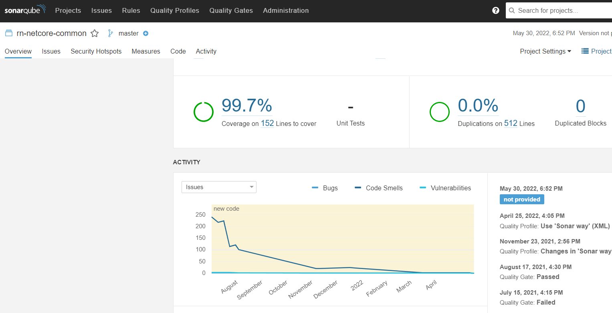

Today I will be covering my [SonarQube](https://www.sonarqube.org/) & [Github Actions](https://github.com/features/actions) integration that I use for the majority of my builds at home.

## Basic Setup
This section will run through setting up the required Docker containers to run SonarQube and its associated database, for my home lab I am making use of [Unraid](https://unraid.net/) so my configuration may differ slightly from [Docker Desktop](https://www.docker.com/products/docker-desktop/) and [Portainer.io](https://www.portainer.io/) however the settings and concepts should be the same.

## MS-SQL Server
SonarQube needs a DB to store data (along with its local ElasticSearch instance). I found that running MS-SQL Server worked well for me.

Below is the configuration that I am using at home:


- **Repo**: `mcr.microsoft.com/mssql/server:2019-latest`
- **Port**: `1433` -> `1433` (TCP)
- **Variable**: `ACCEPT_EULA` = "Y"
- **Variable**: `SA_PASSWORD` = "xxx"
- **Variable**: `MSSQL_PID` = "Developer"
- **Path**: `/var/opt/mssql/data` -> `/mnt/user/appdata/sql-server/data/` (RW)
- **Path**: `/var/opt/mssql/log` -> `/mnt/user/appdata/sql-server/log/` (RW)
- **Path**: `/var/opt/mssql/secrets` -> `/mnt/user/appdata/sql-server/secrets/` (RW)

Once the container is up and running I would suggest connecting to it using [SQL Server Management Studio](https://docs.microsoft.com/en-us/sql/ssms/download-sql-server-management-studio-ssms?view=sql-server-ver16) and adding a new SQL Server managed user for SonarQube to use (I created an user account with the name sonar for this purpose).

## SonarQube Setup
Next we need to setup the SonarQube container, the below settings work well for me:


- **Repo**: `sonarqube`
- **Port**: `9000` -> `9000` (TCP)
- **Variable**: `SONAR_ES_BOOTSTRAP_CHECKS_DISABLE` = "true"
- **Variable**: `SONAR_JDBC_URL` = "jdbc:sqlserver://192.168.0.60;databaseName=SonarQube"
- **Variable**: `SONAR_JDBC_USERNAME` = "sonar"
- **Variable**: `SONAR_JDBC_PASSWORD` = "xxx"
- **Path**: `/opt/sonarqube/data` -> `/mnt/user/appdata/sonarqube/data` (RW)
- **Path**: `/opt/sonarqube/logs` -> `/mnt/user/appdata/sonarqube/logs` (RW)
- **Path**: `/opt/sonarqube/extensions` -> `/mnt/user/appdata/sonarqube/extensions` (RW)

You should now be able to log into SonarQube locally using the configured port and server's URL, follow the prompts to complete the setup of your SonarQube instance.

## Firewall Settings
If you are wanting to run SonarQube externally with a CI-CD service you will need to allow external access to it through your router's firewall.

Personally I make use of a service called [Duck DNS](https://www.duckdns.org/) (as part of my Home Assistant installation) so I just needed to open up the relevant port on my router to allow TCP 9000 traffic into my home, ensure that the port forwards to the bound IP Address of your SonarQube instance, my configuration looks something like this:


The configuration may vary depending on your router, so if you are stuck I would suggest doing a Google search for your router model number and "port forwarding".

## Build Configuration
Once you have exposed SonarQube externally you can continue onto setting up your build in Github.

Through a lot of trial and error I came up with the following scripts that work well for me (feel free to use them) that break up the various tasks associated with the build process and work well with my configuration.

This is a simple build process and I am planning on revamping it in the future, but for now this is working for me.

### Build Scripts
The following build scripts are included with the majority of my projects:

- `.github/ci-build.ps1` ([see it here](https://github.com/rniemand/code-samples/blob/main/blog-posts/2022/ci-cd/ci-build.ps1)) responsible for restoring and building your project - this could be replaced with the appropriate Github actions if you prefer - I do like having some control over the process.
- `.github/ci-test.ps1` ([see it here](https://github.com/rniemand/code-samples/blob/main/blog-posts/2022/ci-cd/ci-test.ps1)) discovers and runs all tests for my projects - at the moment I am enforcing all my tests end with *.T1.Tests as I would like to end up with a proper testing flow for my projects. You can tweak this behaviour in the script pretty easily. This script also produces coverage reports using [reportgenerator](https://github.com/danielpalme/ReportGenerator) for use with SonarQube.

These scripts are still a WIP and will change in the future.

### Github Workflow
Once you have your build scripts defined you will need a way to tie them all together in Github, enter in [Actions](https://github.com/features/actions).

Actions are YAML driven workflows that you can control by simply adding in files to your projects .github/workflows/ folder.

Generally I make use of [this workflow](https://github.com/rniemand/code-samples/blob/main/blog-posts/2022/ci-cd/workflows/sonarqube.yml) for the majority of my SonarQube builds, the steps can be broken down to the following actions:

- Install `JDK` (needed by SonarQube)
- Checks out the repository locally
- Caches and installs SonarQube (tooling, scanner, etc.)
- Runs my `build` and `test` scripts
- Submit build information back to my SonarQube server
- (_Optionally_) packages and pushes to NuGet

### Github Actions
To ensure that there is no sensitive information made public with my build I make use of [Secrets](https://docs.github.com/en/actions/security-guides/encrypted-secrets) with the build and define values as shown below:


Generally I need to define the following secrets for my build to work:

- `SONAR_HOST_URL` = "http://foobar.com:9000"
- `SONAR_PROJECT` = "rn-netcore-common"
- `SONAR_TOKEN` = "xxxx"

These values are substituted into the build using the `${{ secrets.GITHUB_TOKEN }}` placeholders allowing me to reuse most of my build scripts.

Unless you are paying for a SonarQube licence you are most likely only going to want your analysis to run on your repository's main/master branch (this is already part of [my default workflow](https://github.com/rniemand/code-samples/blob/main/blog-posts/2022/ci-cd/workflows/sonarqube.yml)).

With everything set up your workflow should trigger on the next push \ merge to your master branch:


Once the build has been completed you should start seeing feedback in your SonarQube instance:



It is really that simple.

> Your build will fail if Github is unable to reach your SonarQube server, so make sure that you are hosting it on a server that is generally on all the time to avoid failing builds.
{: .prompt-warning }

### Project Configuration
It is recommended to ensure that all *.csproj files have a unique ProjectGuid defined to work properly with SonarQube.

You can do this by adding the following configuration to each .csproj file in your project.

```xml
<PropertyGroup>
  <TargetFramework>net6.0</TargetFramework>
  <ProjectGuid>7...A</ProjectGuid>
</PropertyGroup>
```

> You will need to use a unique GUID each time
{: .prompt-info }

## Visual Studio Integration
You can install [SonarLint](https://www.sonarlint.org/) as an addon into Visual Studio to get additional code analysis while you are working from SonarQube.


> To continue with these steps you will need to have completed a build in Github, or already have a SonarQube project setup.
{: .prompt-info }

Once installed, open the Teams window in VS and click on the SonarQube connection to create a new one.


You will be prompted for a Server URL and credentials to use with the server, enter in the following information:

- **Server URL**: The base URL for your local SonarQube server
- **User**: Create a new token in SonarQube and enter it into the space provided
- **Password**: if you are using a token you can leave this blank


Click OK to create the connection and select the appropriate project from the list that appears:


Once your project has synchronised with SonarQube you should start seeing intellisense suggestions from SonarQube :)


It's really that simple.


## In Closing
This is by no means the best implementation of CI-CD and there is a lot of room for improvement to the overall process, however this works for me and removes a lot of the processes involved in managing NuGet \ Docker projects with automation.

Once I have baselined all my projects the following changes will be coming to this pipeline:

- Automatic versioning of builds (manual at the moment - want to use [semantic versioning](https://semver.org/))
- Introduction of build breakers for failing tests
- Proper flow control based on previous steps outcome
- Layering of the build workflows - flows calling flows (think of a chef)
- etc.

Please feel free to comment \ make use of \ improve this process as I am still learning!
