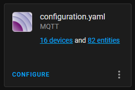

> This post is [part of a series](https://www.richardn.ca/series/#unraid-containers-2022) covering running various containers on [Unraid](https://unraid.net/).
{: .prompt-tip }

In this post I will be covering getting up and running with [MQTT](https://mqtt.org/) on [Home Assistant](https://www.home-assistant.io/), installation is pretty simple when following the [official documentation](https://www.home-assistant.io/integrations/mqtt/) and should take no longer than a couple of minutes.

## Install an MQTT Broker
The first thing you will need to do is install `MQTT` either as a [service running on your computer](https://www.richardn.ca/posts/InstallingMqttOnUbuntu/), or as a Docker container, or using the [Home Assistant Addon](https://www.home-assistant.io/docs/mqtt/broker/).

Personally I am running MQTT as a Docker container with the following configuration.

- **Repo**: `cmccambridge/mosquitto-unraid:latest`
- **Port**: 1883 - 1883 (`TCP`)
- **Path**: `/mosquitto/log` -> `/mnt/user/appdata/mosquitto/log/` (RW)
- **Path**: `/mosquitto/config` -> `/mnt/user/appdata/mosquitto/config/` (RW)
- **Path**: `/mosquitto/data` -> `/mnt/user/appdata/mosquitto/data/` (RW)

You can follow the instructions [here](https://www.richardn.ca/posts/InstallingMqttOnUbuntu/#adding-our-first-user) to add \ manage user accounts.

## Configuring Home Assistant
### custom/mqtt.yaml
I tend to break my configuration up into component specific files (it just feels a lot cleaner to me, and makes excluding portions of configuration a lot simpler too), this is the contents of my `custom/mqtt.yaml` file:

```yaml
# https://www.home-assistant.io/integrations/mqtt/
broker: !secret mqtt_broker
username: !secret mqtt_username
password: !secret mqtt_password
port: !secret mqtt_port
discovery: true
```

> **Note**: the values used for `!secret ...` are located in `secrets.yaml`
{: .prompt-info }

### configuration.yaml
You can add the line below to your `configuration.yaml` file to add MQTT support:

```yaml
mqtt: !include custom/mqtt.yaml
```

After a quick restart of Home Assistant you should now see your MQTT integration.


_MQTT is working_

## All Done
It doesn't get more simple than that :)
