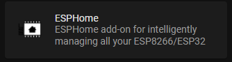
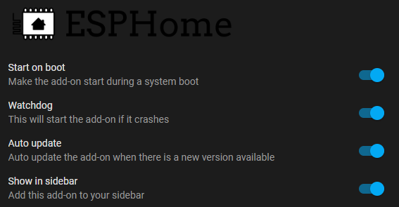
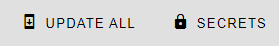
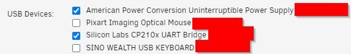
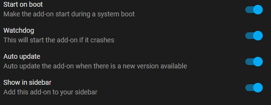
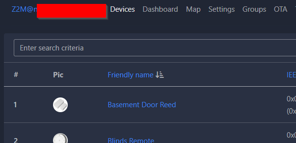
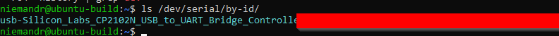
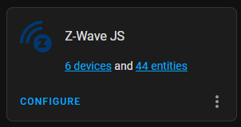
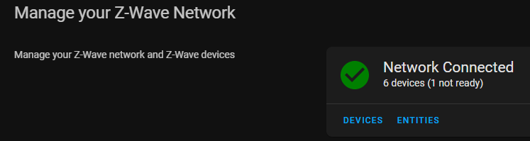

Today I will be covering installing some must-have Add-ons when working with IoT devices at home, namely:

- [ESPHome](https://esphome.io/index.html) - control your ESP8266/ESP32 by simple yet powerful configuration files
- [Zigbee2MQTT](https://www.zigbee2mqtt.io/) - Zigbee to MQTT bridge, get rid of your proprietary Zigbee bridges
- [Z-Wave JS](https://zwave-js.github.io/node-zwave-js/#/) - Z-Wave driver written entirely in JavaScript/TypeScript

Having these add-ons installed will open up a plethora of automation possibilities along, there is a lot to cover here so let’s dive in!

## ESPHome
ESPHome is a configuration driven (`yaml files`) toolchain aimed at ESP8266 / ESP32 devices and allows for quick and easy IoT device deployment and management with its built in UI. My [lounge-clock project](https://www.richardn.ca/posts/LoungeClockV1/) was coded completely using ESPHome and has been one of the simplest deployments I have done to date.

### Installation
The easiest way to install ESPHome is through the Home Assistant addon (detailed instructions can be [found here](https://esphome.io/guides/getting_started_hassio.html)).

In a nutshell, installation is as simple as adding the ESPHome repository (`https://github.com/esphome/home-assistant-addon`) to Home Assistant and installing the preferred release. I would highly recommend using the stable release.



### Configuration
When it comes to configuration there really isn't much to talk about.

Generally speaking you should be able to just install the add-on and use it as-is.



> **NOTE**: it may be worthwhile disabling automatic updates with ESPHome as there have been a couple of breaking changes in the last 2 updates.
{: .prompt-warning }

### Using Secrets
I strongly suggest making use of secrets when working with ESPHome (accessed through the top right navigation button):



Secrets work exactly the same in ESPHome as they do in Home Assistant, allowing for you to version control and share your devices code without exposing any sensitive information to any forum or blog post.

I like to use secrets to store global configuration that is shared between devices, for example:

```yaml
# ===============================
# Global Sensor Configuration
# ===============================
collection_interval_dht: 120s
collection_interval_ldr: 60s
collection_interval_wifi_signal: 300s
```

These values are used by various sensors deployed around my house, ensuring that they all submit data points at a known interval:

```yaml
sensor:
  - platform: dht
    pin: D4
    temperature:
      name: "${display_name} Temperature"
      id: temperature_boys_room
    humidity:
      name: "${display_name} Humidity"
      id: humidity_boys_room
    update_interval: !secret collection_interval_dht
    
  - platform: adc
    pin: A0
    name: "${display_name} Brightness"
    id: boys_room_brightness
    update_interval: !secret collection_interval_ldr
    filters:
      - multiply: 3.3
      
  - platform: wifi_signal
    name: "${display_name} WiFi"
    update_interval: !secret collection_interval_wifi_signal
```

In the example above I am making use of [substitutions](https://esphome.io/guides/configuration-types.html#substitutions) for the sensor block allowing me to literally reuse this code over multiple devices with the correct name and IDs being substituted in at compile time.

## Zigbee2MQTT
To manage the various zigbee devices at home I like to use the [Zigbee2MQTT](https://www.zigbee2mqtt.io/) due to its simplicity and native support for MQTT out of the box.

I found that the Sonoff "[Zigbee 3.0 USB Dongle Plus](https://itead.cc/product/zbdongle-p/?mc_cid=4ccc22dd31&mc_eid=e1d31ea36e)" works the best with Home Assistant and provided you can get your hands on one, is worth the money. If I am not mistaken it is one of the cheapest Zigbee USB Sticks out there.

### Requirements
There are some rather specific requirements for running Zigbee2MQTT on Home Assistant and I strongly suggest checking out the [documentation](https://www.home-assistant.io/integrations/zha/) before you get started, the main requirement being that you are using a compatible Zigbee USB stick. In my testing I found that the "[Zigbee 3.0 USB Dongle Plus](https://itead.cc/product/zbdongle-p/?mc_cid=4ccc22dd31&mc_eid=e1d31ea36e)" flashed with the appropriate firmware works perfectly with my setup.

The following videos / documentation should help out when it comes to flashing:

- [https://www.youtube.com/watch?v=L9lC0Mse0K4](https://www.youtube.com/watch?v=L9lC0Mse0K4)
- [https://www.youtube.com/watch?v=4S_c_m6z-RY](https://www.youtube.com/watch?v=4S_c_m6z-RY)
- [https://www.zigbee2mqtt.io/guide/installation/03_ha_addon.html](https://www.zigbee2mqtt.io/guide/installation/03_ha_addon.html)

### Unraid Configuration
Due to the fact that I am running Home Assistant as a VM on my Unraid server additional configuration is required, namely exposing my **Zigbee USB Stick** to the VM.

I needed to stop the Home Assistant VM and assign the appropriate device to the VM:



This should expose the USB stick to the VM as a serial device once started up again.

### Add-on Installation
To install the add-on add a new add-on repository with the following URL `https://github.com/zigbee2mqtt/hassio-zigbee2mqtt` (detailed instructions [here](https://github.com/zigbee2mqtt/hassio-zigbee2mqtt#installation)), once added you can install the Zigbee2mqtt add-on as per normal.

Once installed head over to configuration and ensure that all the appropriate settings are defined, in my case I am using the following.

#### socat
```yaml
enabled: false
master: pty,raw,echo=0,link=/tmp/ttyZ2M,mode=777
slave: tcp-listen:8485,keepalive,nodelay,reuseaddr,keepidle=1,keepintvl=1,keepcnt=5
options: '-d -d'
log: false
```

#### mqtt
```yaml
base_topic: zigbee2mqtt
server: mqtt://192.168.0.60
user: xxx
password: xxx
```

#### serial
```yaml
port: /dev/ttyUSB0
```

> In Home Assistant to work out the path to your specific USB Stick go to **Settings** -> **System** -> **Hardware**, click the ellipse at the top of the UI and select **All Hardware**.
{: .prompt-tip }

#### additional
You will also need to define a `network_key` for your network - this can be done through the "**edit yaml**" option on the configuration screen, ensure that you backup your network key somewhere safe in case you need to do a reinstall - it will save you from having to re-adopt all your devices again.

### Usage
Once installed you can go ahead and start the add-on:



In the side menu there should be a link to **Zigbee2MQTT**, to add a device, press the "**Permit join (All)**" button at the top of the UI and follow your device specific pairing instructions.



## Z-Wave JS
I have a couple of door locks that can be controlled via Z-Wave so I decided to invest in a "**Zooz 700 Series Z-Wave Plus S2 USB Stick**" to use with [Z-Wave JS](https://www.home-assistant.io/integrations/zwave_js/).

I ran into an odd issue with Unraid and sharing multiple serial based USB sticks with a container that I still have yet to resolve (any help \ suggestions here would be appreciated). Thankfully I have an old Ubuntu server used for [DB backups](https://www.richardn.ca/posts/BackingUpMariaDbViaCron/) that is more than capable of running [Portainer](https://www.portainer.io/) allowing me to run the [zwavejs/zwavejs2mqtt](https://hub.docker.com/r/zwavejs/zwavejs2mqtt) Docker container.

### Obtaining USB Device ID
The first thing you will need to do is work out the path to your USB Serial Device so we can expose it to our container. Running the following command should list all serial devices plugged into your server:

```shell
ls /dev/serial/by-id/
```



In my case I will be using `/dev/serial/by-id/usb-Silicon_Labs_CP2102N_USB_to_UART_Bridge_Controller_xxx`.

### Portainer Configuration
Create a new container in Portainer using the following configuration:

- **Name**: zwavejs
- **Repo Image**: `zwavejs/zwavejs2mqtt:latest`
- **Port**: 3000 - 3000 (TCP)
- **Port**: 8091 - 8091 (TCP)
- **Path**: `/usr/src/app/store` -> **local data store**
- **Network**: bridge mode
- **Variable**: `ZWAVEJS_EXTERNAL_CONFIG` = `/usr/src/app/store/.config-db`
- **Resource**: `/dev/serial/by-id/usb-Silicon_Labs_CP2102N_USB_to_UART_Bridge_Controller_xxx` => `/dev/serial/by-id/usb-Silicon_Labs_CP2102N_USB_to_UART_Bridge_Controller_xxx`

Once done you should be able to start the container and connect to it on port 8091 (in my case http://192.168.0.101:8091/) to configure the container.

Please refer to the [official documentation](https://zwave-js.github.io/zwavejs2mqtt/#/) for any specific configuration options not covered above.

### Adding Z-Wave JS to Home Assistant
To add Z-Wave JS to Home Assistant I just followed the [documentation](https://www.home-assistant.io/integrations/zwave_js/#installing-and-configuring-the-z-wave-js-integration-in-home-assistant) and added a new Z-Wave JS integration using a websocket connection to my Ubuntu server: `ws://192.168.0.101:3000`.

You may need to restart Home Assistant once added to see the changes, however once completed you should now see your Z-Wave JS integration.



### Managing Devices
Management of devices can be done through the web UI or Home Assistant depending on your preference. I find I prefer using Home Assistant for this, but your mileage may vary.



## In Closing
That’s all there is to it, hopefully you found this post useful.

Please feel free to leave any feedback or comments below.
