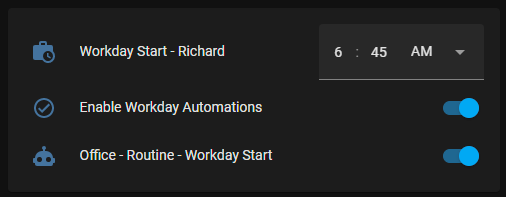
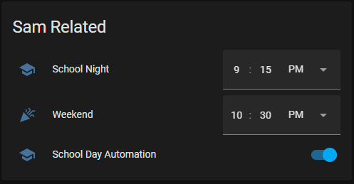

In this post I will explore the concepts of Helpers in Home Assistant and the potential that they can unlock with your automations.

> It is worthwhile adopting a naming convention for your automation to make discovery \ searching easier in the future, I tend to follow an "`<object>` - `<action>` - `<condition>`" pattern.
{: .prompt-tip }

Let’s start.

# Required Integrations
If you are planning on following along at home you will need to add the following integrations to Home Assistant.

## Times of the Day
One of the more useful integrations I use is [Times of the Day](https://www.home-assistant.io/integrations/tod/), which as the name suggests allows you to create a binary sensor that gets its values by checking if the current time is within defined time ranges.

What makes this integration powerful is the fact that it uses your home's location in combination with the [sun integration](https://www.home-assistant.io/integrations/sun/#implementation-details) to provide dynamic values for `sunrise` and `sunset` that can be used in your automations.

In my automation tasks I tend to use the following times of day a lot:

### Before Sunrise
Defined in `custom/binary_sensors/binary.is-daytime.yaml`

```yaml
- platform: tod
  name: "Is Daytime"
  after: sunrise
  before: sunset
```

Simple binary sensor that is enabled between sunrise and sunset, there are no hard-coded times here to adjust as the length of the days changes during the year.

### Night
Defined in `custom/binary_sensors/binary.is-evening.yaml`

```yaml
- platform: tod
  name: "Is Evening"
  after: sunset
  after_offset: "-00:10"
  before: sunrise
```

Similar to **Before Sunrise**, however I subtract 10 min from “sunset” to ensure that my lights are on just a little bit before.

> If you are using any of the before modifiers make sure that you take them into consideration for your automations.
{: .prompt-info }

## Workday
The [workday](https://www.home-assistant.io/integrations/workday/) binary sensor indicates whether the current day is a workday or not. It allows specifying which days of the week will count as workdays and also uses the Python module [holidays](https://pypi.org/project/holidays/) to incorporate information about region-specific public holidays.

Using the workday integration I am able to create binary sensors for **school days** and **work days** allowing me to add context aware automations for my kids, i.e. allowing them to sleep in on the weekends.

### Is School Night
Defined in `custom/binary_sensors/is-school-night.yaml`”.`

```yaml
- platform: workday
  name: "Is School Night"
  country: CA
  province: AB
  workdays: [sun, mon, tue, wed, thu]
  excludes: [fri, sat]
```

I ensure that my country and province is set along with the appropriate days to use for tracking school days. This works for 90% of my use-cases but things like the schools PD Days etc are not catered for here. Currently I am just manually toggling the relevant automations when required.

### Is Workday
Defined in `custom/binary_sensors/is-workday.yaml`

```yaml
- platform: workday
  name: "Is Workday"
  country: CA
  province: AB
  workdays: [mon, tue, wed, thu, fri]
```

Pretty much a copy of the “Is School Day” sensor, I decided to separate them in the hopes that in the future I can adjust the school nights one to cater for various PD Days, snow days etc. this is to ensure that I don’t need to back track and redo any automations that share this logic in the future.

## Including the sensors
To load these sensors into Home Assistant I include them in my main “configuration.yaml” file like so:

```yaml
binary_sensor: !include_dir_merge_list custom/binary_sensors
```


Thats it - these sensors are good to go with any of your automations.

# Helpers
Helpers are a relatively new concept to Home Assistant that has been getting a lot of love over the last 4-6 months, and allow for dynamic values for use with automations. These values can either be defined via the Home Assistant UI, or through various wizards when setting up automations.

By far the most useful helpers are the **Date and/or Time**, **Dropdown**, **Group** and **Number** helpers, however there are so many of them available, with the list growing with each release it seems.

# Automations
Below are some sample automations that make use of the **Times of Day** and **Workday** sensors along with some custom helpers.

## Office - Routine - Workday Start
Simple automation that uses a Date Time helper in combination with the Workday sensor to turn on the lights \ plugs in my office when my work day starts.

```yaml
alias: Office - Routine - Workday Start
description: ''
trigger:
  - platform: time
    at: input_datetime.workday_start_richard
condition:
  - condition: and
    conditions:
      - condition: state
        entity_id: binary_sensor.is_workday
        state: 'on'
      - condition: state
        entity_id: input_boolean.enable_workday_automations
        state: 'on'
action:
  - service: light.turn_on
    data: {}
    target:
      entity_id: light.office_lamp
  - service: switch.turn_on
    data: {}
    target:
      entity_id:
        - switch.plug_2
        - switch.plug_3
  - service: light.turn_on
    data:
      brightness_pct: 81
    target:
      entity_id: light.nas
mode: single
```



## Sam - School Day - Start (06:45)
On school days I use this automation to ensure that my daughter is up for 7:00 am, this makes use of the **Is School Day** sensor and basically just turns on her lights in the morning:

```yaml
alias: Sam - School Day - Start (06:45)
description: ''
trigger:
  - platform: time
    at: '06:45:00'
condition:
  - condition: and
    conditions:
      - condition: state
        entity_id: binary_sensor.is_workday
        state: 'on'
      - condition: state
        entity_id: input_boolean.school_automation
        state: 'on'
action:
  - service: light.turn_on
    data:
      brightness_pct: 96
    target:
      entity_id:
        - light.sam_overhead
        - light.sam_bedside
  - service: light.turn_off
    data: {}
    target:
      entity_id: light.samsign
mode: single
```

I make use of a boolean toggle to quickly enable \ disable the automation when needed.


In addition to this I have another automation that re-enabled this toggle at the start of the next day (~10:00 am) in case I forget to re-enable it manually.

## School Related Automations
### Set Scene - Sam Bedtime - Weekends
This automation makes use of the Workday sensor along with dynamic times to activate a specified scene on the weekends for my daughter.

```yaml
alias: Set Scene - Sam Bedtime - Weekends
description: ''
trigger:
  - platform: time
    at: input_datetime.sam_bedtime_weekend
condition:
  - condition: state
    entity_id: binary_sensor.is_school_night
    state: 'off'
action:
  - scene: scene.sam_bedtime
mode: single
```

### Set Scene - Sam Bedtime - School Automation (On)
Similar to the above this automation will turn off Sam's lights at the appropriate time in the evenings on a school night.

```yaml
alias: Set Scene - Sam Bedtime - School Automation (On)
description: ''
trigger:
  - platform: time
    at: input_datetime.sam_bedtime_school_night
condition:
  - condition: and
    conditions:
      - condition: state
        entity_id: input_boolean.school_automation
        state: 'on'
      - condition: state
        entity_id: binary_sensor.is_school_night
        state: 'on'
action:
  - scene: scene.sam_bedtime
mode: single
```

### Set Scene - Sam Bedtime - School Automation (Off)
Helper automation to cater for school specific off days when Sam can stay up a bit later in the evenings.

```yaml
alias: Set Scene - Sam Bedtime - School Automation (Off)
description: ''
trigger:
  - platform: time
    at: input_datetime.sam_bedtime_weekend
condition:
  - condition: and
    conditions:
      - condition: state
        entity_id: input_boolean.school_automation
        state: 'off'
      - condition: state
        entity_id: binary_sensor.is_school_night
        state: 'on'
action:
  - scene: scene.sam_bedtime
mode: single
```

### Pulling it all together
To allow for easier control of Sam’s automations i created the following view that allows me to quickly toggle \ tweak any values that I may need to:



## Light Automations
Below are a few automation examples I use with some of the lighting around my house.

### External - Lights - Turn Off (Mornings)
Dynamic automation to turn off lights based on the sunrise.

```yaml
alias: External - Lights - Turn Off (Mornings)
description: ''
trigger:
  - platform: state
    entity_id: binary_sensor.is_daytime
    from: 'off'
    to: 'on'
    for:
      hours: 0
      minutes: 5
      seconds: 0
condition: []
action:
  - service: switch.turn_off
    target:
      entity_id:
        - switch.front_lights
        - switch.holiday_lights
    data: {}
  - service: light.turn_off
    target:
      entity_id:
        - light.deck_light
    data: {}
mode: single
```

### External - Lights - Turn On (Evenings)
Dynamic automation used to turn on lights based on the sunset.

```yaml
alias: External - Lights - Turn On (Evenings)
description: ''
trigger:
  - platform: state
    entity_id: binary_sensor.is_evening
    from: 'off'
    to: 'on'
condition: []
action:
  - service: switch.turn_on
    target:
      entity_id: switch.front_lights
    data: {}
mode: single
```

### Dining Area - Lights - Turn Off - Display Cabinet (Mornings)
Helper automation to ensure that specific lights are turned off regardless of sunrise \ sunset.

```yaml
alias: Dining Area - Lights - Turn Off - Display Cabinet (Mornings)
description: ''
trigger:
  - platform: state
    entity_id: binary_sensor.is_daytime
    from: 'off'
    to: 'on'
    for:
      hours: 0
      minutes: 5
      seconds: 0
condition: []
action:
  - service: light.turn_off
    target:
      entity_id: light.display_cabinet
    data: {}
mode: single
```

## Changing Lounge Clock Scene
Another use for the Times of Day integration is to adjust the style of my **[lounge clock](https://www.richardn.ca/posts/LoungeClockV1/)**, making it more visible during the day, and dimming it in the evenings. Below are a couple of the automations I use for that:

```yaml
alias: Lounge Clock - Set Scene - Early Evening
description: ''
trigger:
  - platform: state
    entity_id: binary_sensor.is_evening
    from: 'off'
    to: 'on'
condition: []
action:
  - delay:
      hours: 0
      minutes: 10
      seconds: 0
      milliseconds: 0
  - scene: scene.lounge_clock_early_evening
mode: single
```

```yaml
alias: Lounge Clock - Set Scene - Early Morning
description: ''
trigger:
  - platform: time
    at: '07:00:00'
condition: []
action:
  - scene: scene.lounge_clock_early_morning
mode: single
```

# In Closing
Undoubtedly you can see that the possibilities opened up by adding just these 2 sensors to Home Assistant are numerous, with the addition of being location aware and adjusting to the sunrise and sunset times for your area saves you from having to constantly update times to match dawn \ dusk is worth the effort.

I hope that you found this post useful, and would love to see the automations that you can come up with.

Happy hacking!
