Recently I bought myself a new 3D Printer, more specifically a new shiny "[Voxelab Aries 3D Printer](https://www.voxelab3dp.com/product/aries-high-end-fdm-3d-printer-for-beginners?cID=29)" which `imho` is a pretty good value printer for its price point (_paid ~ CAD$ 400_ all in). My only complaints with the printer is the fact that the firmware is closed source and the provided slicer leaves a lot behind in terms of functionality when compared to [Cura](https://ultimaker.com/software/ultimaker-cura) or similar slicing software.

In this post I will cover getting the printer up and running in Cura along with providing a suggested Cura profile that you can use as a template.

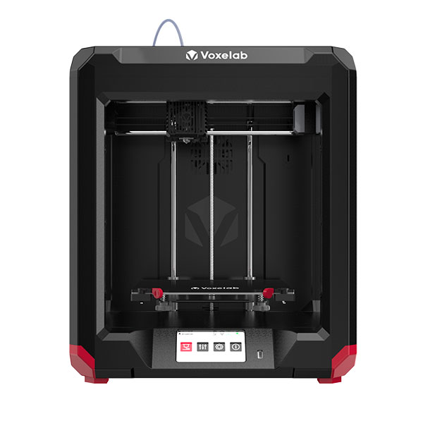

During my research I stumbled upon [this post](https://www.reddit.com/r/VoxelabAries/comments/tavi0i/cura_profile_for_the_aries/) where [/u/deEvilUrge](https://www.reddit.com/user/deEvilUrge/) provided some insight into his interaction with [Voxelab3dp](https://www.voxelab3dp.com/) and the recommended settings to use with Cura, which i happily jotted down to test with my printer, and after some tweaking I have come up with a somewhat more refined version of those initial settings.

## Cura Configuration

### Defining your Printer

Once you have Cura installed you can add a new printer following these settings:

Add a new printer to Cura (`Preferences` -> `Configure Cura` -> `Printers` -> `Add New`):

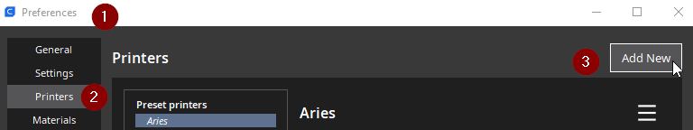

On the next screen:

1. Select "**Add a non-networked printer**"
2. Select Custom
3. Ensure that “Custom FFF printer” is selected
4. Enter in a name for your printer
5. Click next

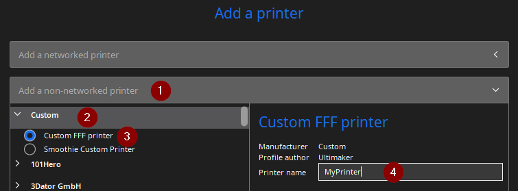

Ensure that you enter in the following settings the **Printer Settings** section:

- X (Width): `200 mm`
- Y (Depth): `200 mm`
- Z (Height): `200 mm`
- Build Plate Shape: `Rectangular`
- Origin at Center: `Ticked`
- Heated Bed: `Ticked`
- G-Code flavour: `Marlin`

Ensure that the following setting are entered into the **Printhead Settings** section:

- X min: `-26 mm`
- Y min: `-28 mm`
- X max: `32 mm`
- Y max: `40.5 mm`
- Gantry Height: `30.1 mm`
- Numbe of extruders: `1`
- Apply Extruder offsets to G-Code: `Ticked`

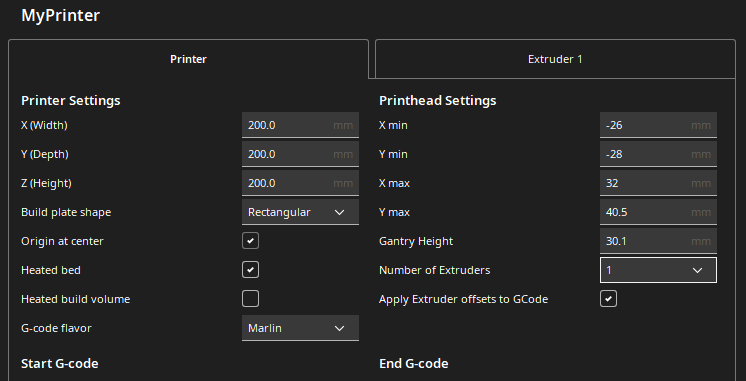

Along with the following **Extruder 1** configuration:

- Nozzle size: `0.4 mm`
- Compatabile material diameter: `1.75 mm`
- Nozzle offset X: `0.0 mm`
- Nozzle offset Y: `0.0 mm`
- Cooling Fan Number: `0`

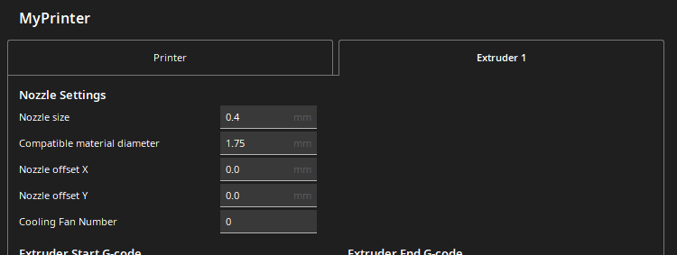

### Importing my starter profile

Once you have your printer defined, navigate to (`Preferences` -> `Configure Cura` -> `Profiles` -> `Import`):

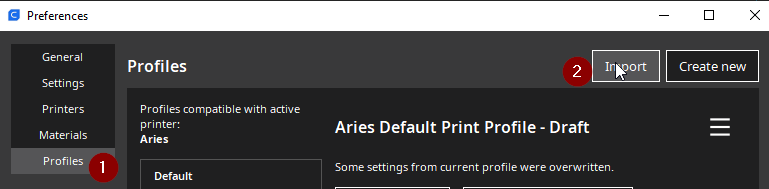

Download and import my [Voxelab-Aries-BaseProfile.curaprofile](https://github.com/rniemand/code-samples/tree/main/3d-printing/Voxelab-Aries) profile, which looks a little something like this:

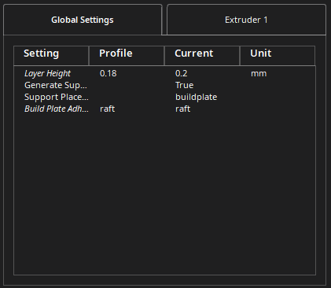
_Global Profile Settings_

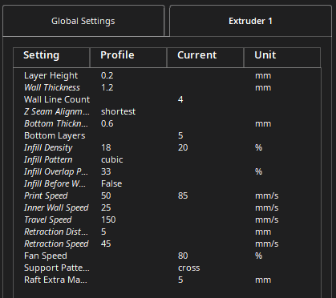
_Extruder Settings_

### Using the Profile

Ensure that you have your printer selected in Cura along with the desired material. Select the `Aries Default Print Profile` profile and make any required changes to the slicer for your model.

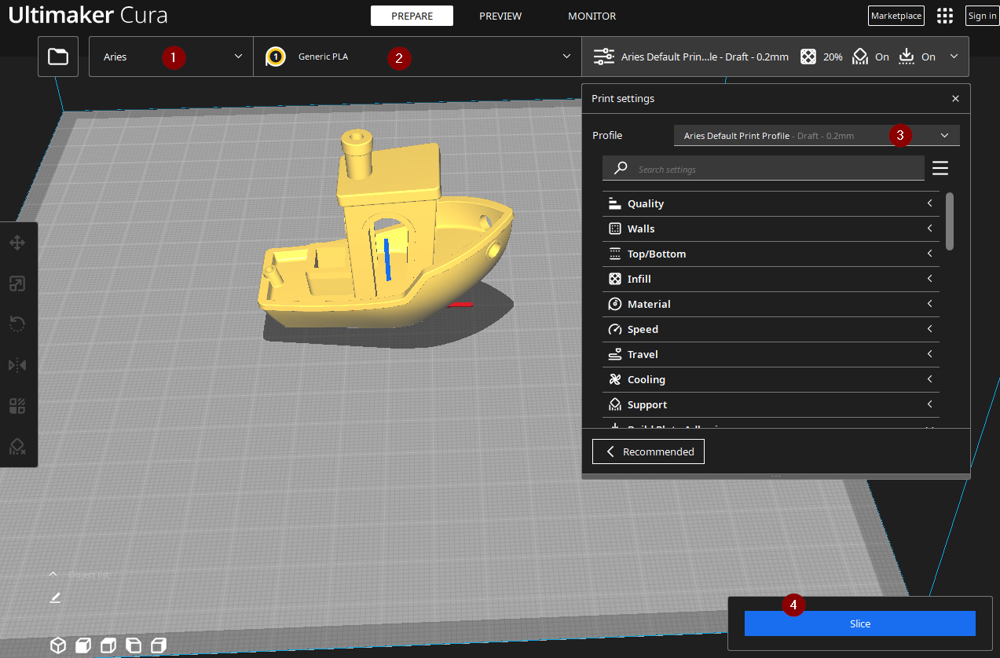

> Below are some sample prints using the base profile - this should be a good starting point for most people.

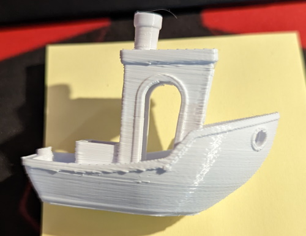

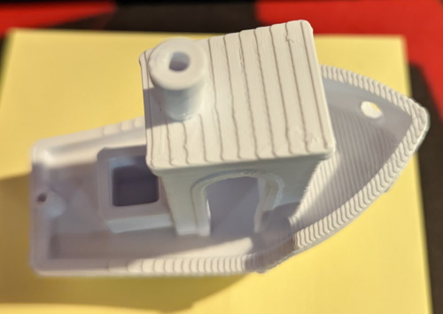

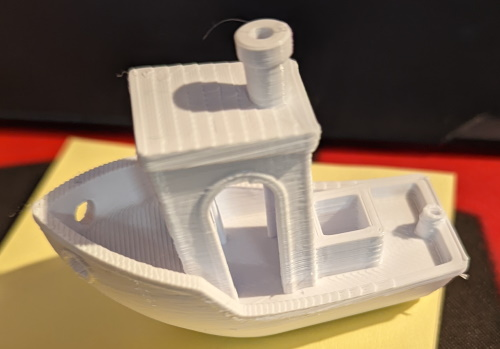

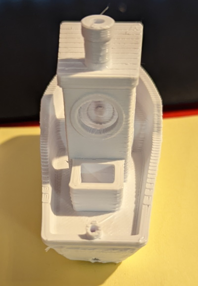

## In Closing

Overall I am happy with the quality of the **Voxelab Aries 3D Printer**, and having the option to replace the default slicer with Cura is a no-brainer.

I hope you found this post helpful and happy printing!
