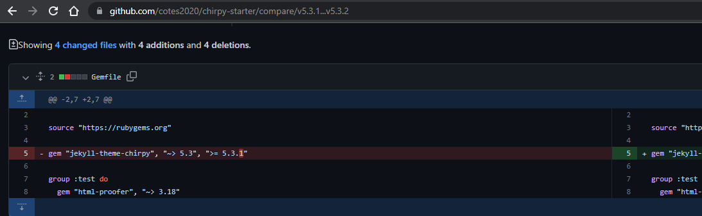

This is a simple post covering the steps required to update the [Chirpy Jekyll Theme](https://github.com/cotes2020/jekyll-theme-chirpy) used by this blog, along with listing some useful pages and tools used for writing my blog posts.

Let's dive in.

## Initial Setup

> Personally I use Windows as my daily driver so this section will cover Windows only.

In order to build and run locally you will need to meet the following requirements:

- Install [Ruby](https://rubyinstaller.org/downloads/)
- Install [Git](https://git-scm.com/)
- Choose and appropriate text editor (I suggest [VS Code](https://code.visualstudio.com/))

Follow the [setup guide](https://github.com/cotes2020/jekyll-theme-chirpy) provided by the template author.

Once setup, check out your repository locally and run the `bundle` command:

```shell
cd <CHECKOUT DIR>
bundle
```

## Writing Flow

You can run either of the commands below to build and preview your site:

```shell
bundle exec jekyll s
 - OR -
bundle exec jekyll s --incremental
```

Once running you can view your site locally at [http://localhost:4000](http://localhost:4000).

## Updating Chirpy

Full process is covered [here](https://github.com/cotes2020/jekyll-theme-chirpy/wiki/Upgrade-Guide), this is more of a cheat sheet for the process:

Determine the version that you are currently on (e.g. `v5.3.1`) and the latest version you are updating too - this can be found [here](https://github.com/cotes2020/jekyll-theme-chirpy/tags) (let's say `v5.3.2`).

Knowing this we can generate a GitHub compare URL that will list all changes between the provided tags (versions) using the following template:

```text
https://github.com/cotes2020/chirpy-starter/compare/<from>...<to>
```

In my sample case this would generate the following URL:

```text
https://github.com/cotes2020/chirpy-starter/compare/v5.3.1...v5.3.2
```

Visitng the URL will list out all the changes between the provided versions:



The update process is just replaying the changes made to the relevant files over your repository.

## Useful Links

Below is a curated list of useful links I have found and use when writing blog posts.

- [Typography supported by Chirpy](https://chirpy.cotes.page/posts/text-and-typography/#titles)
- [Code snippets for writing posts](https://chirpy.cotes.page/posts/write-a-new-post)
- [Enabling Google Pages View](https://chirpy.cotes.page/posts/enable-google-pv/) - was a breaking change a while back.

## Closing

That's all there is to it.

Happy posting!
