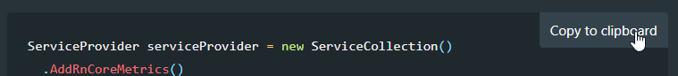
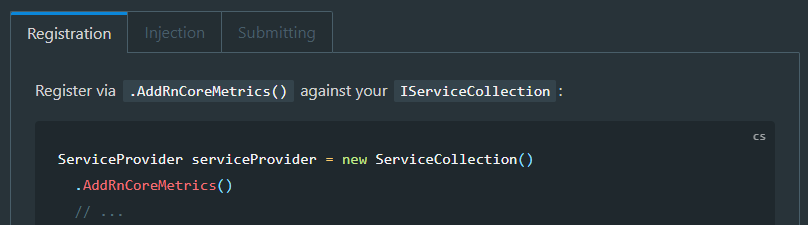
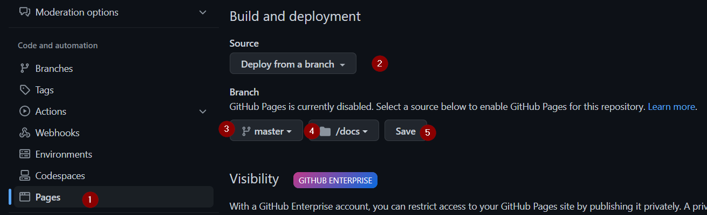

This post is a starter post for `docsify` and it's usage - this is a work in progress and will be updated periodically when I stumble upon anything that I find interesting.

# The docsify Flow

## Installing docsify

This is based on the official [Quick Start Guide](https://docsify.js.org/#/quickstart), and the process is as simple as...

Installing `docsify` globally if you do not already have it installed:

```bash
npm i docsify-cli -g
```

> If you decide to install `docsify` globally, you only need to run the above command once!

## Initializing docsify

To add `docsify` to your project simply naviate to your projects root directory and issue the following command where `./docs` is the name of the directory you wish to save your documentation to:

```bash
docsify init ./docs
```

## General Usage

To serve documentation using `docsify` simply navigate to the directory that contains your documentation and run the following command replacing `docs` with your documentation directory name:

```shell
docsify serve docs
```

This will serve your documentation on [http://localhost:3000](http://localhost:3000) by default.

# Configuring docsify

All core configuration for `docsify` is done in the `index.html` file using the `window.$docsify` script object, I generally configure the following when starting documentation for a new project:

```js
window.$docsify = {
	name: "PROJECT_NAME",
	repo: "rniemand/RepoSlug",
	loadSidebar: true,
	maxLevel: 4,
	subMaxLevel: 3,
	externalLinkRel: "_blank",
};
```

You can see a full list of all configuration options [here](https://docsify.js.org/#/configuration).

# Themes

You can theme `docsify` by simply including a reference to the theme `css` file you would like to use:

```html
<!-- Replace -->
<link rel="stylesheet" href="//cdn.jsdelivr.net/npm/docsify@4/lib/themes/vue.css" />

<!-- with -->
<link rel="stylesheet" href="https://cdn.jsdelivr.net/npm/docsify-themeable@0/dist/css/theme-simple-dark.css" />
```

You can see all possible theme configuration options [here](https://docsify.js.org/#/themes).

> Additional themes can be found on [docsify-themeable](https://jhildenbiddle.github.io/docsify-themeable/#/)!

# Side Navigation

If you would like to customize the side navigation for your documentation you can add `_sidebar.md` to your root documentation directory.

Generally the sidebar is used to place an list of links to make navigating your documentation a lot easier, you can use the global `$docsify` object to configure the behaviour of the sidebar:

```js
window.$docsify = {
	loadSidebar: true,
	maxLevel: 4,
	subMaxLevel: 3,
};
```

# Syntax Highlighting

Docsify makes use of [prismjs](https://prismjs.com/) for it's syntax highlighting support and comes with a couple of pre-installed languages, you may find the need to add in additional `grammar` files to work for your project.

You can browse all supported [grammar files here](https://cdn.jsdelivr.net/npm/prismjs@1/components/) and can include them in your documentation using the following `HTML` snippet:

```html
<script src="//cdn.jsdelivr.net/npm/prismjs@1/components/prism-csharp.min.js"></script>
```

## Common grammar files

These are my go-to grammar files for my projects:

| Language     | Grammar File                                                        |
| ------------ | ------------------------------------------------------------------- |
| Bash / Shell | //cdn.jsdelivr.net/npm/prismjs@1/components/prism-bash.min.js       |
| C#           | //cdn.jsdelivr.net/npm/prismjs@1/components/prism-csharp.min.js     |
| JSON         | //cdn.jsdelivr.net/npm/prismjs@1/components/prism-json.min.js       |
| PowerShell   | //cdn.jsdelivr.net/npm/prismjs@1/components/prism-powershell.min.js |
| TSql         | //cdn.jsdelivr.net/npm/prismjs@1/components/prism-sql.min.js        |
| Yaml         | //cdn.jsdelivr.net/npm/prismjs@1/components/prism-yaml.min.js       |

# Plugins

`Docsify` has support for plugins and has a couple of good [official plugins](https://docsify.js.org/#/awesome?id=plugins) along with a curated list of [community driven plugins](https://docsify.js.org/#/awesome?id=plugins) that should meet the needs of most application documentation.

Below are a couple of plugins that I like to include with my documentation:

## Copy to Clipboard

The [copy-to-clipboard](https://docsify.js.org/#/plugins?id=copy-to-clipboard) is used to add a **Copy to clipboard** option on any code sample when the plugin is installed:



Installation:

```html
<script src="//cdn.jsdelivr.net/npm/docsify-copy-code/dist/docsify-copy-code.min.js"></script>
```

Configuration:

```js
window.$docsify = {
	// docsify-copy-code (defaults)
	copyCode: {
		buttonText: "Copy to clipboard",
		errorText: "Error",
		successText: "Copied",
	},
};
```

## Tabs

The [tabs](https://docsify.js.org/#/plugins?id=tabs) plugin allows you to define and use tabs in an effort to reduce the length of generated pages:



Installation:

```html
<script src="https://cdn.jsdelivr.net/npm/docsify-tabs@1"></script>
```

Configuration:

```js
window.$docsify = {
	// ...
	tabs: {
		persist: true, // default
		sync: true, // default
		theme: "classic", // default
		tabComments: true, // default
		tabHeadings: true, // default
	},
};
```

# GitHub Pages

There are multiple deployment options available when using `docsify`, however the mpst apt one for me is the built in **pages** support from GitHub.

You can refer to the full [deployment guide here](https://docsify.js.org/#/deploy?id=github-pages) if you require additional information - however the configuration is pretty straight forward:



- Select **Pages** under your repos settings
- Ensure that **Deploy from a branch** is selected
- Select the appropriate `branch` and `source` folder to deploy from
- Click **Save** to persist the changes

Once configured your documentation should be available on your configured GitHub custom domain - e.g. `https://www.richardn.ca/<repo-name>/#/`

# In Closing

Hopefully this makes documentation a bit easier.
