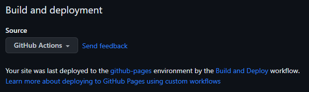
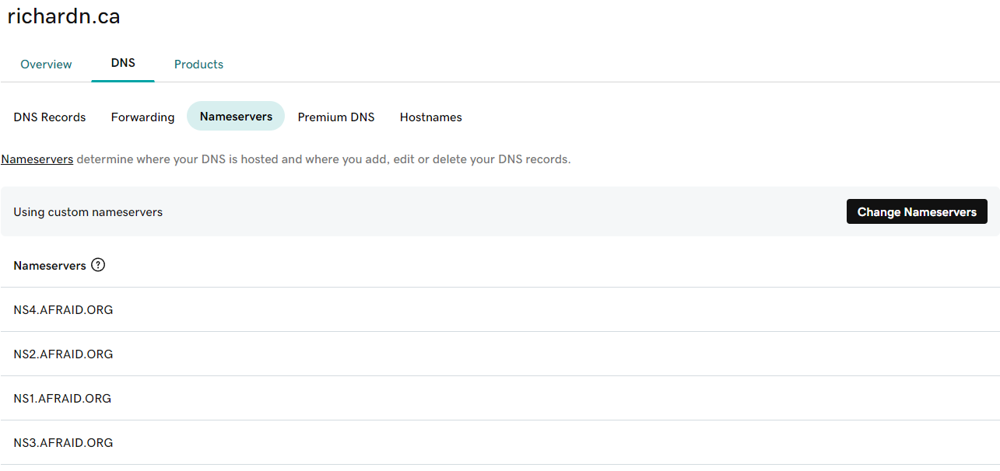
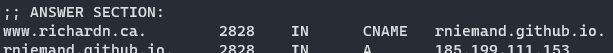
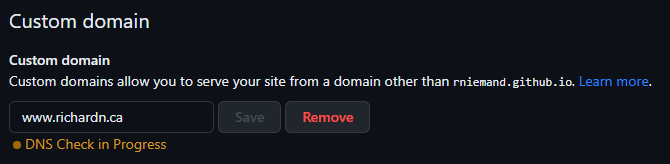
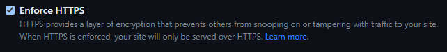
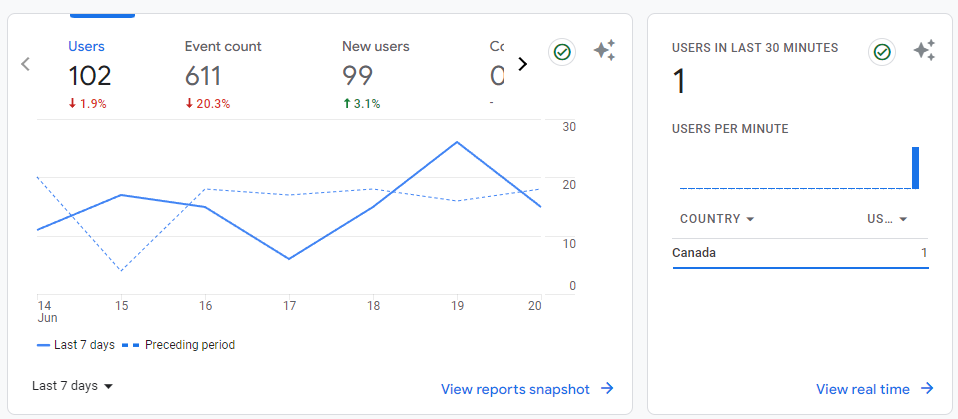

In this post I will cover the process I used to get this blog ([https://www.richardn.ca/](https://www.richardn.ca/)) running under a custom domain on [GitHub Pages](https://pages.github.com/) along with getting Google Analytics and Adsense working with the [chirpy-starter template](https://github.com/cotes2020/chirpy-starter).

## Step 1: Setting up GitHub Pages

The first thing you will need to do is create your personal GitHub pages repository.

The name of this repository needs to be your **GitHub username** + `.github.io` - in my case I would need to create a repository with a name of `rniemand.github.io`.

Once you have created the repository check it out locally on your computer.

## Step 2: Add your sites contents

The gist of this step is committing any static HTML used for your site, as far as I can tell GitHub pages only supports static sites for your `.github.io` site. This is an easy limitation to work around by making use of a static site generator (**SSG**) of which there are many to choose from.

Personally I love the flow \ configuration of [Chirpy](https://github.com/cotes2020/chirpy-starter) which has an excellent [getting started guide](https://chirpy.cotes.page/posts/getting-started/) which covers most of the steps needed to get your blog up and running.

I will summarise it at a high level below should you need it:

- Fork the [starter template](https://github.com/cotes2020/jekyll-theme-chirpy/fork)
- Check out the repository locally
  - Ensure that you let all git submodules initialise
- Run the `bundle` command to install required dependencies
- Make required changes to the `_configyml` file for your site
- Build and serve the site using the `bundle exec jekyll s` command
- Once running, browse your site locally at [http://localhost:4000](http://localhost:4000)
- Manage / edit your blog posts
- Commit and push changes once done

I go into a bit more detail in [this blog post](https://www.richardn.ca/posts/UpdatingChirpy/) should you need more information.

## Step 3: Setting up GitHub pages

If you are using Chirpy and have checked in any changes to your site you can enable automatic build and deployments in GitHub Pages by performing the following actions on your repositories GitHub page:

- Navigate to **Settings**
- Select **Pages** in the left hand menu
- Under the **build and deployment** section
  - Set **GitHub Actions** as your source
- Click save to update your preferences

Your settings should look something like this:



The next time you push changes to your blog the `pages-deploy.yml` action should run:


### Using a custom domain

To use a custom domain I followed the steps outlined in the official [GitHub Pages documentation](https://docs.github.com/en/pages/configuring-a-custom-domain-for-your-github-pages-site/verifying-your-custom-domain-for-github-pages#verifying-a-domain-for-your-user-site), which basically requires that you add a custom **CNAME** for your site that points to your GitHub Pages repository name (e.g. `rniemand.github.io`).

I purchased my domain through [GoDaddy](https://www.godaddy.com/en-ca) and use [FreeDNS](https://freedns.afraid.org/) to manage my domain (this is not required as GoDaddy has all the tooling that you need). Because I am using a custom DNS provider I needed to point manually define my nameservers on my domain as shown below:



To pass the required verification from GitHub I needed to create a **CNAME** entry called `www.richardn.ca` and point it to `rniemand.github.io` - wait some time for the change to propagate (you can check the propagation status using a command like `dig` on linux):

```shell
dig www.richardn.ca
```



Once your changes are live you should be able to set your custom domain in GitHub as shown below:



You should also claim your domain under your GitHub user profile: [https://github.com/settings/pages](https://github.com/settings/pages).

This can be done by following the instructions listed [here](https://docs.github.com/en/pages/configuring-a-custom-domain-for-your-github-pages-site/about-custom-domains-and-github-pages).


### Using HTTPS

If you would like to serve your blog over HTTPS (generally a must for these days) you can simply check the “Enforce HTTPS” checkbox on your repositories Pages configuration section as shown below:



Provided that you have verified your domain with GitHub you should be able to browse your site on HTTPS - an SSL certificate will be generated for you by GitHub and used for your site:


## Step 4: Analytics and Advertising

Provided you are using the [Chirpy](https://github.com/cotes2020/chirpy-starter) theme (SSG) mentioned above you should be able to follow the steps below to configure Google Analytics and Adsense on your blog for some passive income.

### Adding Google Analytics

In order to add Google Analytics to your site you will need to insert a custom tracking script into every page of your blog as per the normal analytics setup process.

Initially this stumped me for a while, but after some Google searches the solution is as simple as:

- Creating a new file called `./_includes\head.html` in the root of your repository
  - This will overwrite the default one used by Chirpy
- Copy the contents from the original [head.html](https://github.com/cotes2020/jekyll-theme-chirpy/blob/master/_includes/head.html) file to your local copy
- Insert the required script tag provided by Google somewhere into your head.html file
  - I opted to insert it above this line `{ % unless site.theme_mode % }`
- Commit and push your changes
- Once GitHub Pages has completed the build action triggered by your commit you should start seeing data for your blog in Google Analytics



### Setting up Google Adsense

Enabling Google Adsense is a lot simpler when compared to Analytics, and involves the following steps:

- Obtain your `ads.txt` file from Adsense
  - This will be provided when initially setting up your site
- Add `ads.txt` to the root of your repository and commit the changes
- Allow for GitHub Pages to build your site
- Confirm that your `ads.txt` is available by browsing to it
  - E.g. `https://yoursite.com/ads.txt`
- Once `ads.txt` is available you can continue configuring your site on Adsense


## Step 5: Keeping up to date

Lastly you will need to have some plan in place to ensure that you are keeping your SSG up to date, below is the process that I generally use.

### Updating Chirpy

Updating Chirpy is as simple as checking the [releases page](https://github.com/cotes2020/jekyll-theme-chirpy/tags) and generating a comparison against your local version and the latest build:

- Let's say you are on **v5.5.2** and the latest version is **v6.0.1**
- You can generate a GitHub comparison between the tags like so
  - `https://github.com/cotes2020/chirpy-starter/compare/v5.5.2...v6.0.1`
- Manually apply any changes listed in the compare to your site and commit
- Note the version you are on for the next comparison

I cover this process in more detail in [this post](https://www.richardn.ca/posts/UpdatingChirpy/#updating-chirpy) should you need more information.

### Keep head.html up to date

Be sure from time to time to compare your local copy of `./_includes\head.html` with the maintained version [here](https://github.com/cotes2020/jekyll-theme-chirpy/blob/master/_includes/head.html).

I would suggest doing this every time you update Chirpy to ensure that you do not drift too far from the source version.

### Running locally (Windows)

With a more recent update of Chirpy they updated the localization dependency which has obliterated locally running on Windows using a custom timezone in your `_config.yml` file, specifically this line for me:

```yaml
timezone: America/Edmonton
```

Thankfully the solution is just to remove your timezone from your local configuration file (ensure that you do not commit the removal of this back to your repository) and run the site using the normal `bundle exec jekyll s` command.

This should resolve the issue.

## In Closing

I hope you find this post helpful, please feel free to let me know if I have missed something out in the comments below!
