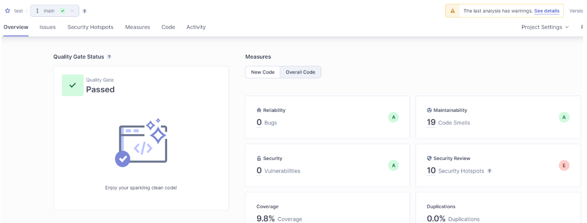

In this post I will cover the basics of getting SonarQube running in a Docker container and walk you through setting up a simple ci-cd script to build and analyse a .net core project.

## Requirements

### JDK

You will need java installed on your system in order to run SonarQube, you can download the latest version of Java from [here](https://www.oracle.com/ca-en/java/technologies/downloads/).

Install or extract the Java package to a known location on your system, in my case I went with installing the JDK which ended up unpacking it’s contents to `C:\Program Files\Java\jdk-21`.

Add a new System Environment variable called **JAVA_HOME** with the following path: `C:\Program Files\Java\jdk-21`.


Add the following path to the systems **PATH** environment variable: `C:\Program Files\Java\jdk-21\bin`.

Open up a console and type `java -version` to ensure that everything is working as expected.


### Docker Desktop

Download and install Docker Desktop from the [following link](https://www.docker.com/products/docker-desktop/).

Ensure that you have WSL enabled and all the other guff needed for Docker to run.

You will most likely need to restart your computer.

### SSMS or Equivalent

You will need SSMS or something similar to connect to the created Docker SQL instance and create the initial SonarQube database, if you would like to you can download SSMS at the [following link](https://learn.microsoft.com/en-us/sql/ssms/download-sql-server-management-studio-ssms?view=sql-server-ver16).

### .NET SDK

You will need the .net SDK along with any targeted frameworks installed, you can download the .net SDK if you need it from [here](https://dotnet.microsoft.com/en-us/download/visual-studio-sdks).

## Docker Environment Setup

### Docker Compose File

The complete Docker compose file is shown below, to follow along copy the below to a file on your system called `docker-compose.yaml`.

```yaml
version: "3.6"

services:
  db:
    image: mcr.microsoft.com/mssql/server:2019-latest
    restart: always
    environment:
      ACCEPT_EULA: "Y"
      SA_PASSWORD: "saP@ssw0rd"
      MSSQL_PID: "Developer"
    volumes:
      - ./mssql/data:/var/opt/mssql/data
      - ./mssql/log:/var/opt/mssql/log
      - ./mssql/secrets:/var/opt/mssql/secrets
    ports:
      - 1433:1433

  sonarqube:
    image: sonarqube
    restart: always
    environment:
      SONAR_ES_BOOTSTRAP_CHECKS_DISABLE: true
      SONAR_JDBC_URL: jdbc:sqlserver://db;databaseName=SonarQube;trustServerCertificate=true;
      SONAR_JDBC_USERNAME: sa
      SONAR_JDBC_PASSWORD: "saP@ssw0rd"
    volumes:
      - ./sonarqube/data:/opt/sonarqube/data
      - ./sonarqube/logs:/opt/sonarqube/logs
      - ./sonarqube/extensions:/opt/sonarqube/extensions
    ports:
      - 9000:9000
    depends_on:
      - "db"
```

### Initial Container Configuration

Open a terminal window and navigate to the folder where you saved your `docker-compose.yaml` file, to start the container run the below command.

```shell
docker-compose up
```

This will take some time for the initial start (subsequent starts will be a lot quicker), also note that the initial start of the container will result in a lot of errors being logged to the console - mainly due to the fact that SonarQube is unable to find the configures SQL database (we are about to resolve that issue now).

Using SSMS or something similar connect to your containers SQL instance using the `sa` password of `saP@ssw0rd`.


Once connected run the below query to create the expected SonarQube database:

```sql
USE [master]
GO
CREATE DATABASE [SonarQube]
 COLLATE SQL_Latin1_General_CP1_CS_AS
GO
ALTER DATABASE [SonarQube] SET RECOVERY SIMPLE
GO
```

You should now have a SonarQube database in the **SQL_Latin1_General_CP1_CS_AS** coalition and a recovery mode of simple.


After a while SonarQube should start to run its initial seeding of the DB, this is due to the fact that the SonarQube docker service is configured to always restart. If SonarQube does not seed the database you can try restarting the container to see if that helps.

You should now be able to navigate to SonarQube on `http://localhost:9000/` and log in with the default user `admin` and password `admin` - make sure that you change your password to something that you can remember.

### Subsequent Starting and Stopping

Once you have completed the initial setup as instructed above subsequent starting and stopping of the container can be done using the following commands.

> These commands need to be run from the folder that you saved your `docker-compose.yaml` file in.
{: .prompt-info }

To start the container:

```shell
docker-compose up -d
```

To stop the container:

```shell
docker-compose down
```

## SonarQube Setup

### Create Project

To create a new project navigate to: `http://localhost:9000/projects/create?mode=manual`.

Enter in the details for your project and click next, choose your preferred settings when prompted on the next screen - generally I just use the global settings.


You should now have a test project to work with.


### Token Generation

To generate tokens head over to your accounts security page: `http://localhost:9000/account/security`.

Complete the form to generate a token - feel free to select a different token type when prompted (I am just using a global analysis token for brevity).


Be sure to save the token returned as you won't be able to see it again!


In my case the generated token is: `sqa_6ac0644c998766a46a0f11ee0205cad162e5318d`.

## Build Process Setup

### Once Off Setup

You will need to have the **sonarscanner** `dotnet tool` installed globally, if you do not have it installed you can use the following command to rectify that:

```shell
dotnet tool install --global dotnet-sonarscanner
```

### Build Scripts

#### sonarqube.ps1

To make the build process a lot simpler I tend to use a helper script aptly named `sonarqube.ps1` with the following body:

```powershell
param (
  [Parameter(Mandatory=$false)]
  [string] $project = "test",
  [Parameter(Mandatory=$false)]
  [string] $sqUrl = "http://localhost:9000",
  [Parameter(Mandatory=$true)]
  [string] $sqToken
)
$rootDir        = $PSScriptRoot;
$artifactsDir   = [IO.Path]::GetFullPath((Join-Path $rootDir "../artifacts/"));
$coverageDir    = [IO.Path]::GetFullPath((Join-Path $artifactsDir "test-coverage/"));
$sqReportPaths  = ($coverageDir + "**/coverage.opencover.xml");
dotnet sonarscanner begin /k:$project /d:sonar.host.url=$sqUrl  /d:sonar.login=$sqToken /d:sonar.cs.opencover.reportsPaths=$sqReportPaths
./ci-test.ps1
dotnet sonarscanner end /d:sonar.login=$sqToken
```

#### ci-test.ps1

I generally make use of a `ci-test.ps1` file to orchestrate the build and test pipeline (it is a bit long winded and may not work for everyone), an example of the build script can be seen [here](https://github.com/rniemand/RnCore.Abstractions/blob/master/.github/ci-test.ps1).

In all honesty, a simple `dotnet build` should suffice in place of the call to `ci-test.ps1` in the `sonarqube.ps1` file - you will lose the coverage reports etc. though, but with some determination you should be able to create a custom build script that works for you.

### Running Build Process

Armed with your build script and now running SonarQube instance you can kick off your first build and analyse using the sonarqube.ps1 file and your generated token.

```shell
.\sonarqube.ps1 -sqToken "sqa_6ac0644c998766a46a0f11ee0205cad162e5318d"
```

Once the process has completed your test project should now be updated with the results of the code analysis run.



