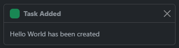

In this post I will cover creating a simple toast message implementation for your next svelte application using [SvelteStrap](https://sveltestrap.js.org/) and a simple toast manager service written in TypeScript.

## Components

You will need to add the following components to your project.

### ToastManager.ts

This file houses the `ToastManager` class which is used to manage toast notifications (`NlpToastMessage`) instances and displays them using the custom `<TopNavigation />` component listed below.

The manager is backed by a [Writable Svelte Store](https://svelte.dev/docs/svelte-store) and internally tracks what toast messages should be displayed along with handling dismiss events on the individual messages.

This class can be extended to add any additional functionality you may need for your specific implementation, for me this works perfectly.

```typescript
import { writable, type Writable } from "svelte/store";
export const toasts: Writable<NlpToastMessage[]> = writable([]);

export class NlpToastMessage {
  public id: number = -1;
  constructor(
    private _manager: ToastManager,
    public title: string,
    public body: string | undefined,
    public color: string,
    public autoHide: boolean = false
  ) {}
  setId = (id: number) => (this.id = id);
  dismiss = () => this._manager.dismiss(this);
}

class ToastManager {
  public toasts: NlpToastMessage[] = [];
  private _toastId: number = 0;
  constructor(private _toasts: Writable<NlpToastMessage[]>) {}
  add = (toast: NlpToastMessage) => {
    toast.setId(this._toastId++);
    this.toasts.push(toast);
    this._toasts.set(this.toasts);
  };
  dismiss = (toast: NlpToastMessage) => {
    let idx = this.toasts.indexOf(toast);
    this.toasts.splice(idx, 1);
    this._toasts.set(this.toasts);
  };
}

const manager = new ToastManager(toasts);

export const toastSuccess = (
  title: string,
  body: string | undefined = undefined,
  autoHide: boolean = true
) =>
  manager.add(new NlpToastMessage(manager, title, body, "success", autoHide));

export const toastError = (
  title: string,
  body: string | undefined = undefined,
  autoHide: boolean = true
) => manager.add(new NlpToastMessage(manager, title, body, "danger", autoHide));
```

### ToastManager.svelte

This is the custom component that wraps the [Toast SvelteStrap](https://sveltestrap.js.org/?path=/story/components-toast--toast) component and places all added toast messages in the bottom corner of your application using the `position-fixed bottom-0 end-0 p-3` [BootStrap](https://getbootstrap.com/) styles.

When the component is mounted it subscribes to the toasts store exposed from `ToastManager.ts` (and unsubscribes when the component is unmounted). Each toast message added to the store is rendered in the [each loop](https://svelte.dev/docs/logic-blocks).

By default all toasts will automatically close after 5 seconds (unless configured not to in the `NlpToastMessage` constructor), clicking the close icon on a toast will trigger the dismiss method on the manager and remove the toast notification immediately.


```html
<script lang="ts">
  import { onMount } from "svelte";
  import { Toast, ToastBody, ToastHeader } from "sveltestrap";
  import { NlpToastMessage, toasts } from "./ToastManager";
  let toastMessages: NlpToastMessage[] = [];

  onMount(() => {
    return toasts.subscribe((_entries: NlpToastMessage[]) => {
      toastMessages = _entries;
    });
  });
</script>

<div class="toast-container position-fixed bottom-0 end-0 p-3">
  {#each toastMessages as entry}
  <Toast autohide>
    <ToastHeader icon="{entry.color}" toggle="{entry.dismiss}">
      {entry.title}
    </ToastHeader>
    {#if entry.body}<ToastBody>{entry.body}</ToastBody>{/if}
  </Toast>
  {/each}
</div>
```


## Usage

Usage is pretty simple, all you need to do is add the `<ToastManager />` component anywhere in your application (I would suggest adding this to your layout file).

```html
<ToastManager />
```

You can create a toast message by calling one of the exposed ToastManager.ts methods:

- toastSuccess(`title: string`[[, `body: string|undefined`], `autoHide: boolean`])
- toastError(`title: string`[[, `body: string|undefined`], `autoHide: boolean`])

An example is shown below:

```typescript
const addTask = async () => {
  const response = await new UserTasksClient().addTask(userTask);
  if (response.success) {
    toastSuccess("Task Added", `${userTask.taskName} has been created`);
    userTask = createNewTask();
    onTaskAdded();
    toggle();
  } else {
    toastError("Error Adding Task", response.error || "Unknown error");
  }
};
```

It is that simple.


