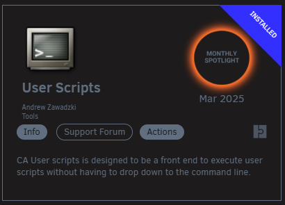
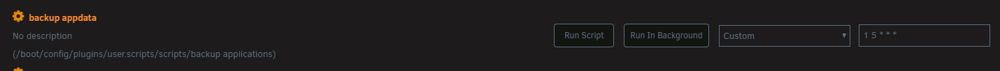
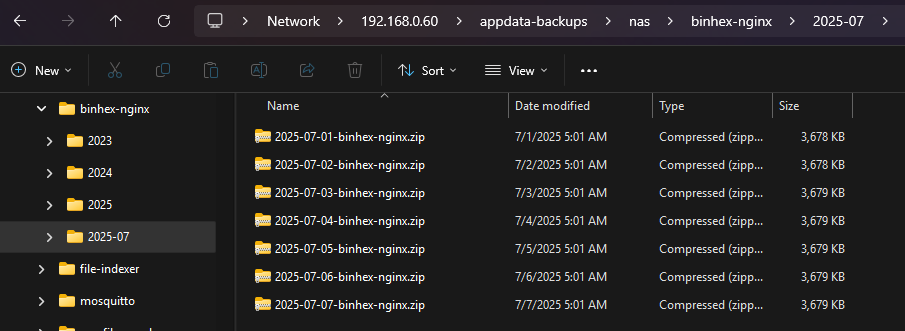

Below is a simple `shell` script that I created to run daily backups of my Unraid servers `appdata` folder.

This will create a daily zip file (following the `/yyyy-mm/yyyy-mm-dd-<folder>.zip` format), all folders are automatically created during the backup process.

> **NOTE**: I set the files permissions to `0777` which you may want to omit for security.

```bash
#!/bin/sh

backupAppdata() {
  echo "============================================="
  echo "Backing up :: $1"
  echo "============================================="
  
  backupTargetRoot="/mnt/user/appdata-backups/nas/$1/$(date '+%Y-%m/')"
  backupZipFile="/mnt/user/appdata-backups/nas/$1/$(date '+%Y-%m/%F')-$1.zip"
  appRootDir="/mnt/user/appdata/$1/"
  
  mkdir -p $backupTargetRoot
  rm -f $backupZipFile
  zip -r $backupZipFile $appRootDir
  chmod -R 0777 $backupTargetRoot
  echo "  > done"
  echo ""
}

backupAppdata "binhex-nginx"
backupAppdata "mosquitto"
```

When adding a new folder to be backed up, simply add it to the end of the script like so (`backupAppdata "<folder>"`).

You will need the `Users Script` Unraid plugin installed for this to work.



Once installed, just create a new script with whatever name works for you, add in your modified version of the above script, and set a [CRON](https://crontab.guru/) schedule for it.



When the script has completed running, you should see the backup in your designated backup location.



Hopefully this saves you some time!
